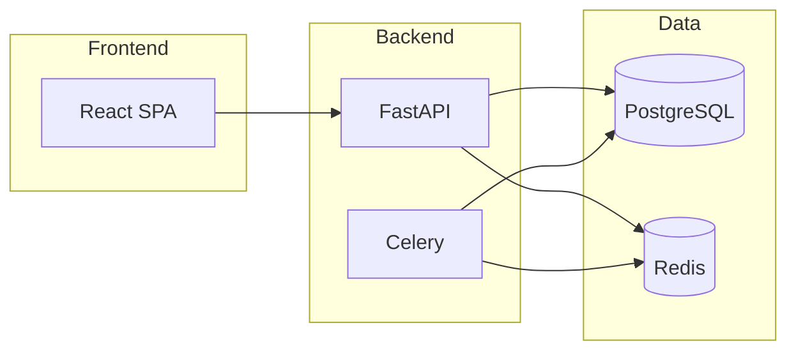

# UNTOLD

**The Story Behind The Glory** — Global sports storytelling platform: OTT streaming, production studio, and AI-powered content pipelines.

[](https://github.com/your-org/untold/actions/workflows/ci.yml)

## Product surfaces

| Surface | URL | Audience |
|---------|-----|----------|
| **Website & OTT** | `/` | Public consumers |
| **Mobile App** | `/app` | Mobile-first streaming |
| **UNTOLD Studio** | `/studio` | Internal production team |
| **UNTOLD AI** | `/ai` | Phase 2 SaaS product |

## Architecture at a glance



| Layer | Stack |
|-------|-------|
| Frontend | React 19, Vite, Tailwind CSS 4, TanStack Query |
| Backend | FastAPI, SQLAlchemy 2, Alembic, Celery |
| Data | PostgreSQL 16, Redis 7 |
| Deploy | Docker, Kubernetes, GitHub Actions |

## Quick start

```bash
# Full stack (Docker)
cp deploy/env/development.env.example .env
docker compose up -d --build

# Frontend only (local)
npm install && npm run dev
```

| Service | URL |
|---------|-----|
| Web | http://localhost:8080 (Docker) or http://localhost:5173 (dev) |
| API | http://localhost:8000 |
| API docs | http://localhost:8000/docs |
| Studio | http://localhost:5173/studio |

**Dev login:** `admin@untold.com` / `ChangeMe123!`

## Enterprise documentation

Full documentation hub: **[docs/README.md](./docs/README.md)**

| Guide | Description |
|-------|-------------|
| [Architecture](./docs/architecture.md) | System design and diagrams |
| [API](./docs/api.md) | REST surface and modules |
| [OpenAPI](./docs/openapi.md) | Spec export and client generation |
| [Database](./docs/database.md) | Schema domains and migrations |
| [AI](./docs/ai.md) | AI provider layer |
| [Authentication](./docs/authentication.md) | JWT, RBAC, enterprise auth |
| [Deployment](./docs/deployment.md) | CI/CD, K8s, compose |
| [Developer Guide](./docs/developer-guide.md) | Local setup and conventions |
| [Admin Guide](./docs/admin-guide.md) | UNTOLD Studio operations |
| [Folder Structure](./docs/folder-structure.md) | Repository layout |
| [Production Ready](./docs/production-ready.md) | Readiness assessment |
| [CTO Final Audit](./docs/cto-final-audit-report.md) | Before/after scores & launch recommendation |
| [Runbooks](./docs/runbooks/README.md) | Incident, backup, rollback |
| [ADRs](./docs/adr/README.md) | Architecture decisions |

### Operations

- [Production checklist](./docs/production-checklist.md)
- [Deployment guide](./docs/deployment-guide.md)
- [Testing guide](./docs/testing-guide.md)
- [Security improvements](./docs/security-improvements.md)

## Development

```bash
# Backend tests
cd backend && pytest

# Frontend tests
npm test

# E2E
npm run test:e2e

# Export OpenAPI spec
cd backend && python scripts/export_openapi.py
```

## Repository structure

```
untold/
├── backend/          # FastAPI API, workers, AI layer
├── src/              # React — web, studio, AI, mobile
├── deploy/           # Docker, K8s, monitoring, scripts
├── docs/             # Enterprise documentation
└── e2e/              # Playwright tests
```

See [folder structure](./docs/folder-structure.md) for the complete tree.

## Production deploy

```bash
cp deploy/env/production.env.example .env
docker compose -f docker-compose.yml -f docker-compose.prod.yml up -d --build
./deploy/scripts/smoke-test.sh
```

Kubernetes: `kubectl apply -k deploy/kubernetes` — see [deployment guide](./docs/deployment-guide.md).

## License

Proprietary — UNTOLD Media. All rights reserved.
