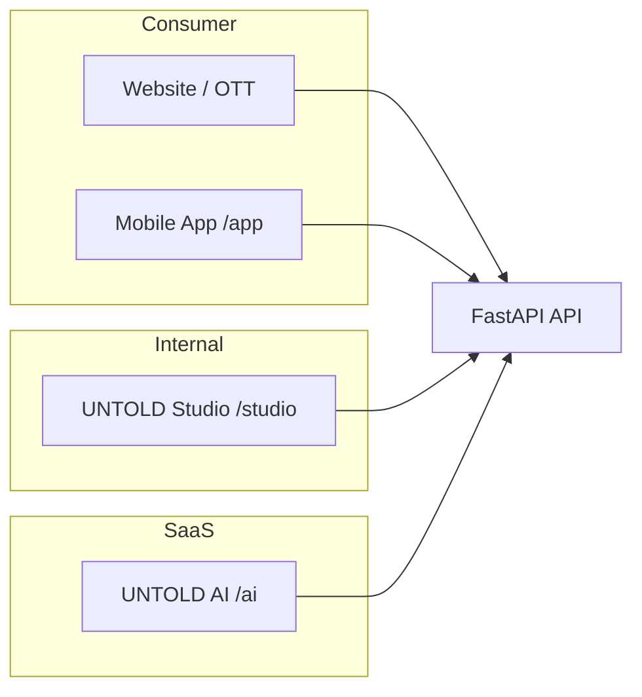

# UNTOLD Enterprise Documentation

Official documentation for the UNTOLD global sports storytelling platform — consumer OTT, production studio, and AI services.

## Documentation map

| Document | Audience | Description |
|----------|----------|-------------|
| [Architecture](./architecture.md) | Engineering, leadership | System design, surfaces, data flow, diagrams |
| [API](./api.md) | Integrators, backend | REST surface, versioning, auth patterns |
| [OpenAPI](./openapi.md) | Integrators | Swagger/ReDoc, export, gateway spec |
| [Database](./database.md) | Backend, DBA | Schema domains, migrations, conventions |
| [AI](./ai.md) | Studio, ML engineers | Provider layer, capabilities, cost tracking |
| [Authentication](./authentication.md) | Security, backend | JWT, sessions, RBAC, enterprise auth |
| [Deployment](./deployment.md) | DevOps, SRE | Environments, CI/CD, K8s, compose |
| [Developer Guide](./developer-guide.md) | All engineers | Local setup, conventions, testing |
| [Admin Guide](./admin-guide.md) | Studio operators | UNTOLD Studio workflows and roles |
| [Folder Structure](./folder-structure.md) | New contributors | Repository layout reference |
| [Production Ready](./production-ready.md) | Release managers | Readiness gates and operational maturity |
| [**CTO Final Audit**](./cto-final-audit-report.md) | Leadership | Before/after scores & launch recommendation |

## Operations

| Resource | Description |
|----------|-------------|
| [Runbooks](./runbooks/README.md) | Incident response, backup, rollback, migrations |
| [Production Checklist](./production-checklist.md) | Pre/post-deploy gate list |
| [Infrastructure](./infrastructure/README.md) | Quick-start for Docker, monitoring, K8s |

## Architecture decisions

| ADR | Topic |
|-----|-------|
| [ADR index](./adr/README.md) | How we record decisions |
| [0001](./adr/0001-monorepo-three-surfaces.md) | Monorepo with three product surfaces |
| [0002](./adr/0002-fastapi-postgresql-stack.md) | FastAPI + PostgreSQL + Redis |
| [0003](./adr/0003-unified-ai-provider-layer.md) | Unified AI provider layer |
| [0004](./adr/0004-jwt-session-rbac.md) | JWT sessions and studio RBAC |
| [0005](./adr/0005-kubernetes-production-deployment.md) | Kubernetes for production |
| [0006](./adr/0006-celery-async-workers.md) | Celery background workers |

## Deep dives (specialized)

| Document | Topic |
|----------|-------|
| [AI Architecture](./ai-architecture.md) | Full AI layer implementation detail |
| [Security Improvements](./security-improvements.md) | Threat model and hardening |
| [Testing Guide](./testing-guide.md) | Pytest, Vitest, Playwright, CI |
| [API Gateway](./api-gateway/README.md) | External API gateway and keys |
| [Enterprise Security](./enterprise-security/README.md) | IdP, MFA, audit, compliance |
| [Plugins](./plugins/README.md) | Plugin SDK for studio extensions |

## Product surfaces

| Surface | URL path | Purpose |
|---------|----------|---------|
| **Website** | `/` | Public OTT, originals, news, live |
| **Mobile App** | `/app` | Mobile-first OTT experience |
| **UNTOLD Studio** | `/studio` | Internal production OS (team only) |
| **UNTOLD AI** | `/ai` | Phase 2 SaaS product shell |
| **API** | `/api/v1`, `/gateway` | REST, GraphQL gateway, WebSocket |

## Support matrix

| Environment | API docs | Debug | Seed data |
|-------------|----------|-------|-----------|
| Development | `/docs`, `/redoc` | Enabled | Optional |
| Staging | `/docs` (optional) | Disabled | Controlled |
| Production | Disabled | Disabled | Never |

---

*Last updated: enterprise documentation v1.0 — aligns with API v1.0.0 and migration `038_ai_prompt_versioning`.*
