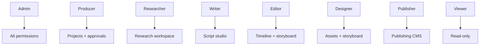
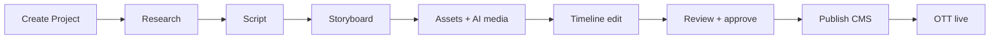

# UNTOLD Studio — Admin Guide

**UNTOLD Studio** (`/studio`) is the internal production operating system for creating, managing, and publishing UNTOLD originals. This guide is for producers, editors, researchers, and platform administrators.

## Access

| Requirement | Details |
|-------------|---------|
| URL | `https://yourdomain.com/studio` (local: `http://localhost:5173/studio`) |
| Login | Studio-enabled account with assigned role |
| Legacy URL | `/admin/*` redirects to `/studio/*` |

Default dev admin: `admin@untold.com` / `ChangeMe123!`

## Role overview

| Role | Can create projects | Can approve | Can publish |
|------|---------------------|-------------|-------------|
| Admin | Yes | Yes | Yes |
| Producer | Yes | Yes | Yes |
| Researcher | No | No | No |
| Writer | No | No | No |
| Editor | No | No | No |
| Designer | No | No | No |
| Publisher | No | Limited | Yes |
| Viewer | No | No | No |

Contact an **Admin** to change your `studio_role` via **Team & Users** (`/studio/users`).

## Navigation map

### Overview

| Page | Path | Purpose |
|------|------|---------|
| Dashboard | `/studio` | Production KPIs, recent activity |
| Ecosystem Map | `/studio/ecosystem` | Product surface diagram |

### Produce — content pipeline

| Page | Path | Workflow stage |
|------|------|----------------|
| Projects | `/studio/projects` | Project hub |
| Collaboration | `/studio/collaboration` | Real-time docs |
| Research | `/studio/research` | Fact-finding, sources |
| Scripts | `/studio/scripts` | Writing + AI assist |
| Storyboard | `/studio/storyboard` | Visual planning |
| Asset Library | `/studio/assets` | Media management |
| Timeline Editor | `/studio/timeline` | Post-production |
| AI Studio | `/studio/ai` | AI command center |
| Image Studio | `/studio/images` | AI images |
| Video Studio | `/studio/videos` | AI video |
| Voice Studio | `/studio/voice` | Voice synthesis |
| Music Studio | `/studio/music` | Music generation |
| Shorts Generator | `/studio/shorts` | Short-form |
| SEO Studio | `/studio/seo` | SEO variants |
| Translation Studio | `/studio/translation` | Localization |
| Publishing Agent | `/studio/publishing-agent` | Automated publishing |
| Publishing CMS | `/studio/content` | Schedule & distribute |
| Localization | `/studio/ai-localization` | Multi-language pipeline |
| E-Magazine | `/studio/magazine` | Magazine editions |
| Human & AI Team | `/studio/team` | Team roster |

### Platform tools

| Page | Path | Purpose |
|------|------|---------|
| Quick Pipeline | `/studio/pipeline` | One-click production run |
| Workflow Engine | `/studio/workflows` | Custom automation |
| Agent Marketplace | `/studio/marketplace` | Install AI agents |
| Plugin Marketplace | `/studio/plugins` | Studio extensions |
| API Gateway | `/studio/api-gateway` | External API keys |
| Enterprise Security | `/studio/security` | MFA, IdP, audit |
| AI Cost Optimization | `/studio/ai-cost` | Budgets and usage |

### Originals feedback

| Page | Path | Purpose |
|------|------|---------|
| Viewer Analytics | `/studio/analytics` | OTT engagement |
| Subscriptions | `/studio/membership` | Plan management |
| Revenue | `/studio/revenue` | Revenue dashboard |

### Operations

| Page | Path | Purpose |
|------|------|---------|
| Admin Panel | `/studio/admin` | System settings |
| Team & Users | `/studio/users` | User management |
| Notifications | `/studio/notifications` | Studio alerts |

## Typical production workflow

### Step-by-step

1. **Create project** — `/studio/projects` → New project → assign team members
2. **Research** — Open research workspace → add sources, notes, AI summaries → submit for approval
3. **Script** — Script workspace → draft with AI writer → version history → approval
4. **Storyboard** — Generate scenes → designer review → approval
5. **Media** — Image/video/voice/music studios → assets land in Asset Library
6. **Timeline** — Assemble in Timeline Editor → export job
7. **Publish** — Publishing CMS → schedule platforms → webhook notifications
8. **Monitor** — Viewer Analytics for performance feedback

Use **Quick Pipeline** (`/studio/pipeline`) to run automated multi-step workflows.

## Approvals

Approvals are required at gated stages (research, script, storyboard, publish):

- **Submitters:** Writers, researchers, editors
- **Approvers:** Producers and Admins
- Notifications appear in `/studio/notifications`

## AI usage guidelines

- Check **AI Cost Optimization** before large batch runs
- Use **prompt library** versions for repeatable outputs
- Review AI-generated content before approval — human sign-off required
- Rate limits apply (30 generates/minute per user)

## Enterprise security (admins)

`/studio/security` provides:

- Identity provider (SAML/OIDC) configuration
- MFA enrollment requirements
- IP allow/deny rules
- Audit event log
- Secrets vault (encrypted credentials)

See [Enterprise Security](./enterprise-security/README.md).

## API keys (admins)

External partners access UNTOLD via `/gateway` with API keys managed at `/studio/api-gateway`:

1. Create key with descriptive name and scopes
2. Copy key once (not shown again)
3. Monitor usage in gateway dashboard
4. Rotate keys periodically

## Troubleshooting

| Issue | Action |
|-------|--------|
| Cannot access studio | Confirm `studio_role` assigned |
| Permission denied on project | Check project membership role |
| AI generation stuck | Check `/studio/ai-cost`; review Celery workers |
| Upload failed | Check asset permissions; file size limits |
| Session expired | Re-login at `/studio/login` |

For platform incidents, see [Runbooks](./runbooks/README.md).

## Related documents

- [Authentication](./authentication.md) — roles and permissions detail
- [AI](./ai.md) — AI capabilities
- [API](./api.md) — studio API endpoints
- [Admin Guide API errors](./api.md#error-codes)
