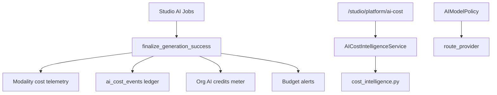

# AI Cost Intelligence

Production-grade AI spend tracking, forecasting, optimization, and automatic provider routing for UNTOLD Studio.

## Capabilities

| Feature | Description |
|---------|-------------|
| **Provider & model costs** | LLM token pricing + per-unit rates for image, video, voice, music, translation |
| **Usage units** | Tokens, images, video seconds, voice characters, music seconds, translation characters |
| **Budgets** | Global, organization, user, and project scopes with soft alerts and hard limits |
| **Alerts** | In-app notifications at threshold % and limit exceeded |
| **Predictions** | Linear burn-rate projection for current month |
| **Optimization** | Rule-based recommendations (model dominance, cache, media spend, routing) |
| **Automatic routing** | Cost-aware model selection via policies + `POST /routing/resolve` |
| **Reports** | Monthly JSON snapshots (Celery: 1st of month 06:00 UTC) |
| **Dashboard** | Studio admin UI + `/intelligence` API with modality breakdown |

## Architecture

## Data model

| Table | Purpose |
|-------|---------|
| `ai_generations` | Per-job cost_usd, tokens, model (source of truth) |
| `ai_cost_events` | Granular ledger with modality + units (migration `041`) |
| `ai_cost_budgets` | Monthly USD limits by scope |
| `ai_cost_alerts` | Threshold and limit alerts |
| `ai_model_policies` | Per-module routing, cache, fallback chain |
| `ai_response_cache` | Deduplicated responses with savings tracking |
| `ai_monthly_cost_reports` | Archived dashboard snapshots |

## API (`/api/v1/studio/platform/ai-cost`)

| Method | Path | Description |
|--------|------|-------------|
| GET | `/dashboard` | Standard cost dashboard |
| GET | `/intelligence` | Extended dashboard + predictions + optimizations |
| POST | `/routing/resolve` | Cost-aware provider/model routing decision |
| GET | `/pricing` | Provider pricing catalog |
| GET/POST/PATCH/DELETE | `/budgets` | Budget CRUD |
| GET/PATCH | `/policies/{module}` | Model policies |
| GET | `/alerts` | Budget alerts |
| GET/POST | `/reports` | Monthly reports |

## Modality pricing

Configured in `app/domain/ai/cost_intelligence.py`:

- **Tokens** — `MODEL_PRICING` in `cost_optimizer.py`
- **Images** — USD per image (DALL·E, Imagen, Stable Diffusion)
- **Video** — USD per second (Runway, Sora)
- **Voice** — USD per character (ElevenLabs, OpenAI TTS)
- **Music** — USD per second (Suno, Udio)
- **Translation** — USD per character + token fallback

## Integration

Every completed generation calls `finalize_generation_success()` which:

1. Computes modality-aware cost via `build_cost_telemetry`
2. Persists `cost_usd` on `ai_generations`
3. Writes `ai_cost_events` row
4. Syncs org `AI_CREDITS` billing meter
5. Evaluates budget alerts

Wired in: `AIStudioService`, `ImageStudioService`, `VideoStudioService`, `VoiceStudioService`, `MusicStudioService`, `TranslationStudioService`, `SEOStudioService`, `ShortsStudioService`.

## Rollout

1. `alembic upgrade head` through `041_ai_cost_intelligence`
2. Set budgets per org/project in Studio → AI Cost
3. Configure model policies per module (`auto`, `cheapest`, `quality`, `fixed`)
4. Use `/intelligence` dashboard for predictions and optimization tips

## Related

- [AI](./ai.md)
- [Enterprise Billing](./enterprise-billing.md)
