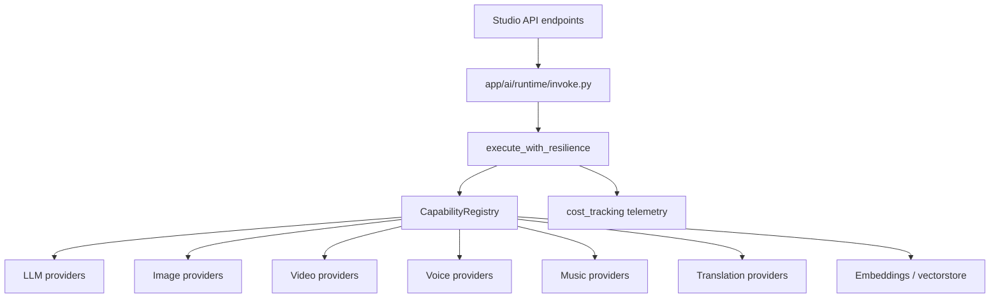
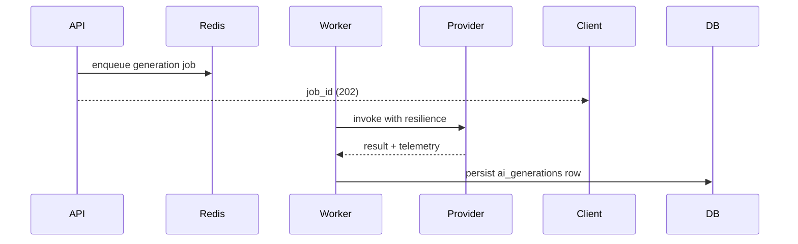

# AI Platform

UNTOLD's AI layer powers research, scripting, storyboards, image/video/voice/music generation, translation, SEO, and embeddings — through a **single provider registry** with resilience and cost tracking.

> **Implementation detail:** See [AI Architecture](./ai-architecture.md) for code-level documentation.

## Capability map



## Capabilities

| Capability | Domain registry | Primary methods |
|------------|-----------------|-----------------|
| LLM | `get_provider_registry()` | `generate()` |
| Image | `get_image_registry()` | `generate()` |
| Video | `get_video_registry()` | `generate()` |
| Voice | `get_voice_registry()` | `generate()`, `preview()` |
| Music | `get_music_registry()` | `generate()`, `preview()` |
| Translation | `get_translation_registry()` | `translate()` |
| Embeddings | `get_embeddings_registry()` | `embed()` |
| Vector store | `get_vectorstore_registry()` | `upsert()`, `search()` |

Public imports (unchanged for backward compatibility):

```python
from app.ai import get_ai_registry, get_provider_factory, ensure_bootstrapped
```

## Provider resolution

`CapabilityRegistry.resolve()` order:

1. Explicit `preferred` provider (if enabled)
2. Capability default from `AIConfig`
3. Remaining enabled providers (sorted)
4. Fallback: `media_stub` / `demo` providers

Configure defaults via environment (`AI_DEFAULT_LLM`, etc.) — see `backend/app/ai/config.py`.

## Resilience

All invocations through `app/ai/runtime/invoke.py`:

| Policy | Default |
|--------|---------|
| Retries | 2, exponential backoff (0.5s base) |
| Timeout | 120s (60s embeddings) |
| Fallback | Next provider in chain |
| Cost metadata | Attached to `result.meta["telemetry"]` |

## Prompt versioning

`PromptVersionService` manages `ai_prompt_library`:

| Column | Purpose |
|--------|---------|
| `prompt_key` | Stable key `{module}:{slug}` |
| `version` | Monotonic integer per key |
| `is_current` | One active version per key |

```python
from app.ai.prompts import PromptVersionService

text, version = PromptVersionService.resolve_text(
    db, "script", "Outline v1", variables={"topic": "..."}
)
```

Migration `038_ai_prompt_versioning` adds versioning columns.

## Cost optimization

| Feature | Location |
|---------|----------|
| Per-request telemetry | `app/ai/runtime/cost_tracking.py` |
| Budgets & alerts | `ai_cost_budgets`, `ai_cost_alerts` tables |
| Response cache | `ai_response_cache` |
| Model policies | `ai_model_policies` |
| Studio UI | `/studio/ai-cost` |
| API | `/api/v1/ai-cost` |

## Studio AI modules

| Module | API prefix | UI route |
|--------|------------|----------|
| AI command center | `/ai-studio` | `/studio/ai` |
| Research agent | `/research-studio` | `/studio/research` |
| Script writer | `/script-studio` | `/studio/scripts` |
| Storyboard | `/storyboard-studio` | `/studio/storyboard` |
| Image | `/image-studio` | `/studio/images` |
| Video | `/video-studio` | `/studio/videos` |
| Voice | `/voice-studio` | `/studio/voice` |
| Music | `/music-studio` | `/studio/music` |
| Shorts | `/shorts-studio` | `/studio/shorts` |
| SEO | `/seo-studio` | `/studio/seo` |
| Translation | `/translation-studio` | `/studio/translation` |
| Publishing agent | `/publishing-agent` | `/studio/publishing-agent` |
| Localization | AI pipeline | `/studio/ai-localization` |

## Async AI jobs

Long-running generation runs as Celery tasks (`app/workers/tasks.py`):



Poll job status via studio endpoints or WebSocket studio channel.

## Configuration

| Variable | Purpose |
|----------|---------|
| `OPENAI_API_KEY` | OpenAI LLM / embeddings |
| `ANTHROPIC_API_KEY` | Claude models |
| Additional keys | Per-provider in `AIConfig` |

Rate limits: `30/minute` on generate endpoints (see [Security](./security-improvements.md)).

## Adding a new provider

1. Implement provider class in `app/ai/providers/` or domain bridge
2. Register **once** in `app/ai/bootstrap.py`
3. Domain registries sync via `sync_legacy_registry()` — do not double-register
4. Add tests in `backend/tests/`
5. Document in ADR if architectural impact

## Verification

```bash
cd backend
python -c "from app.ai import ensure_bootstrapped; ensure_bootstrapped(); print('OK')"
alembic upgrade head   # through 038
curl -s http://localhost:8000/api/v1/ai-studio/overview -H "Authorization: Bearer $TOKEN"
```

## Related documents

- [AI Architecture](./ai-architecture.md)
- [ADR 0003: Unified AI provider layer](./adr/0003-unified-ai-provider-layer.md)
- [API: AI modules](./api.md)
