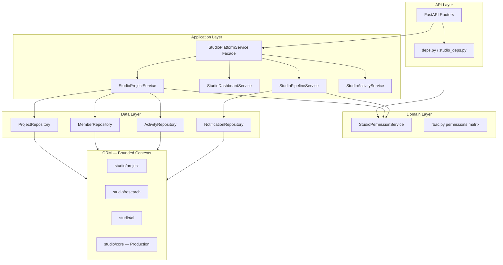

# UNTOLD Studio — Architecture Refactor

Production refactor: bounded-context models, repository layer, split services, facade for API compatibility.

## Folder Changes

```
backend/app/
├── models/
│   ├── studio/                    # NEW — bounded-context ORM models
│   │   ├── __init__.py            # Public exports + Production/AIAgentJob
│   │   ├── core.py                # Production, AIAgentJob (was studio.py)
│   │   ├── project.py             # Members, tasks, approvals, calendar
│   │   ├── research.py
│   │   ├── script.py
│   │   ├── storyboard.py
│   │   ├── assets.py
│   │   ├── ai.py
│   │   ├── publishing.py
│   │   ├── workflow.py
│   │   ├── marketplace.py
│   │   ├── collaboration.py
│   │   ├── timeline.py
│   │   ├── platform.py            # API keys, feature flags, settings
│   │   ├── plugins.py
│   │   ├── gateway.py
│   │   └── enterprise.py
│   └── studio_platform.py         # Barrel re-export (backward compatible)
├── repositories/                  # NEW — data access layer
│   ├── base.py
│   ├── project_repository.py
│   ├── member_repository.py
│   ├── activity_repository.py
│   └── notification_repository.py
├── domain/studio/
│   └── permissions.py             # NEW — RBAC without service coupling
├── services/studio/               # NEW — split application services
│   ├── activity_service.py
│   ├── project_service.py
│   ├── dashboard_service.py
│   └── pipeline_service.py
├── services/studio_platform_service.py  # Facade (unchanged API)
└── core/studio_deps.py            # NEW — repository DI helpers
```

**Removed:** `app/models/studio.py` (merged into `models/studio/core.py`)

## Updated Architecture



## Migration Strategy

| Phase | Action | DB Migration |
|-------|--------|--------------|
| 1 | Split `studio_platform.py` models into `models/studio/*` | **None** — table names unchanged |
| 2 | Move `studio.py` → `models/studio/core.py` | **None** |
| 3 | Add repositories + domain permissions | **None** |
| 4 | Split services; facade preserves `StudioPlatformService` API | **None** |
| 5 | Agent services use `StudioPermissionService` (breaks circular imports) | **None** |

**Import migration for new code:**

```python
# Prefer
from app.models.studio import ResearchSession, Production
from app.domain.studio.permissions import StudioPermissionService
from app.repositories.project_repository import ProjectRepository

# Still valid (legacy)
from app.models.studio_platform import ResearchSession
from app.services.studio_platform_service import StudioPlatformService
```

## Refactor Plan (completed)

1. Split 86 ORM classes from monolithic `studio_platform.py` into 15 bounded-context modules
2. Introduce `SqlAlchemyRepository` base + 4 aggregate repositories
3. Extract `StudioPermissionService` to domain layer
4. Split god-service into `Project`, `Dashboard`, `Pipeline`, `Activity` services
5. `StudioPlatformService` remains a static-method facade — **zero API router changes**
6. Remove circular lazy imports in agent services

## Modified Files

| Category | Files |
|----------|-------|
| Models | `models/studio/*` (16 files), `studio_platform.py`, deleted `studio.py` |
| Repositories | `repositories/*` (5 files) |
| Domain | `domain/studio/permissions.py` |
| Services | `services/studio/*` (5 files), `studio_platform_service.py` |
| DI | `core/deps.py`, `core/studio_deps.py` |
| Agents | `research_agent_service.py`, `script_agent_service.py`, `storyboard_agent_service.py` |
| Tooling | `scripts/split_studio_models.py` |

## Rollback

Revert git commit. No database rollback required.

## Verification Checklist

- [x] `from app.main import app` succeeds
- [x] `from app.models import Production` works
- [x] `from app.models.studio_platform import ResearchSession` works (barrel)
- [x] `StudioPlatformService.list_projects` delegates to `StudioProjectService`
- [ ] `alembic upgrade head` on clean DB (schema unchanged)
- [ ] Studio dashboard API returns same shape
- [ ] Project CRUD + RBAC for non-admin studio users

```bash
cd backend
python -c "from app.main import app; from app.services.studio_platform_service import StudioPlatformService; print('OK')"
python -m alembic upgrade head
```
