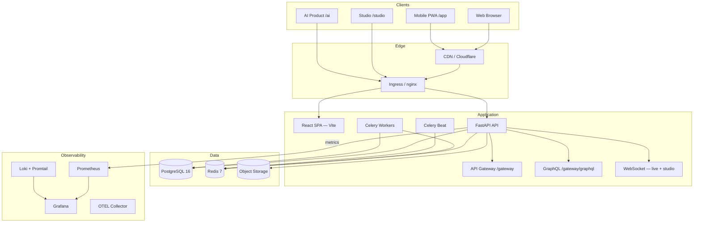
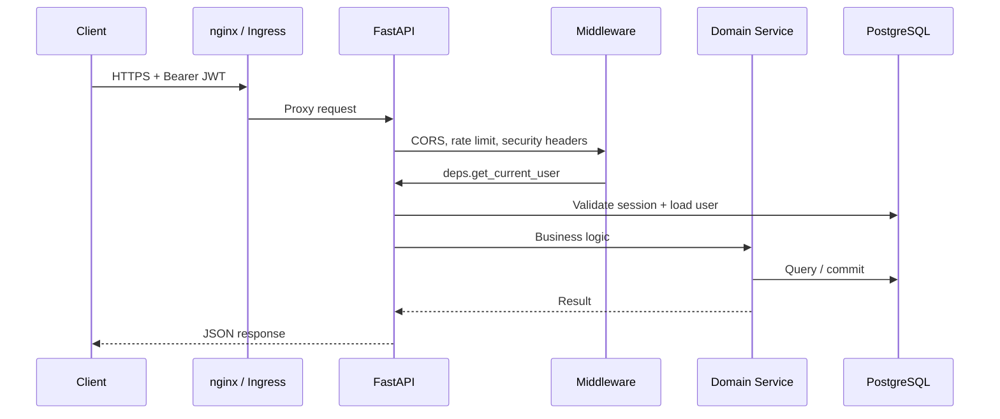
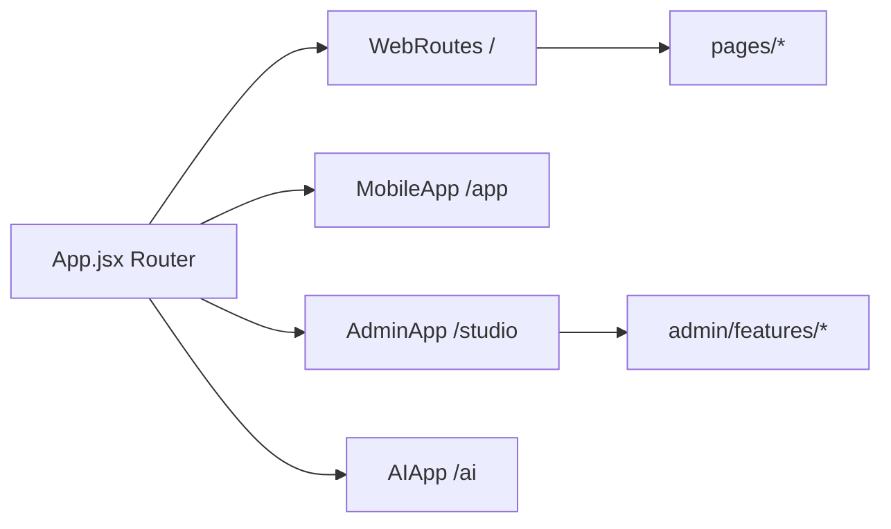
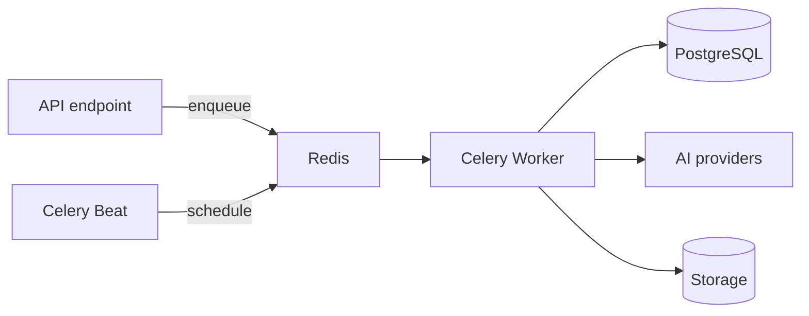

# System Architecture

UNTOLD is a full-stack sports storytelling ecosystem: consumer streaming (OTT), an internal production studio, and AI-powered content pipelines — unified by a single FastAPI backend and PostgreSQL data store.

## High-level architecture

## Architectural principles

1. **Monorepo, multiple surfaces** — One repository; consumer web, studio, and AI are separate React route trees sharing components and API clients where appropriate.
2. **API-first** — All clients consume `/api/v1`; external integrators use `/gateway` with API keys.
3. **Domain-driven backend** — Business logic in `app/domain/`; HTTP thin in `app/api/v1/`; persistence in `app/models/`.
4. **Unified AI layer** — All LLM, image, video, voice, music, translation, and embedding calls route through `app/ai/` with retry, fallback, and cost telemetry.
5. **Production by default** — Health probes, structured logging, rate limits, security headers, migrations, and observability are built in.

## Request flow (authenticated API)

## Backend layers

| Layer | Path | Responsibility |
|-------|------|----------------|
| **HTTP** | `app/api/v1/` | Routes, validation, dependency injection |
| **Services** | `app/services/` | Orchestration, cross-domain workflows |
| **Domain** | `app/domain/` | Business rules, provider registries, RBAC |
| **AI runtime** | `app/ai/` | Provider resolution, invoke, cost tracking |
| **Models** | `app/models/` | SQLAlchemy ORM entities |
| **Workers** | `app/workers/` | Celery tasks (async jobs, pipelines) |
| **Gateway** | `app/gateway/` | External API, usage metering, GraphQL |
| **WebSocket** | `app/websocket/` | Live events, studio collaboration rooms |

## Frontend surfaces

| Surface | Entry | Auth context |
|---------|-------|--------------|
| Website | `src/pages/`, `src/routes/WebRoutes.jsx` | `WebAuthContext` |
| Mobile | `src/app/MobileApp.jsx` | Shared web auth |
| Studio | `src/admin/AdminApp.jsx` | `AdminAuthContext` + studio JWT |
| AI | `src/ai/AIApp.jsx` | Product-specific (Phase 2) |

Legacy `/admin/*` URLs redirect to `/studio/*`.

## Core domain modules

| Domain | Backend | Studio UI |
|--------|---------|-----------|
| Content & OTT | `videos`, `streaming`, `watchlist` | Content, analytics |
| Live sports | `live`, WebSocket | Live components |
| News & magazine | `news`, `magazine` | Magazine page |
| Monetization | `payments`, `membership` | Revenue, subscriptions |
| Production studio | `studio_platform`, `*_studio` | Full studio nav |
| Workflows | `workflow_engine`, `production_pipeline` | Workflows, pipeline |
| Collaboration | `collaboration` | Collaboration workspace |
| Enterprise | `enterprise_security*` | Security dashboard |
| Plugins | `plugin_sdk` | Plugin marketplace |
| API Gateway | `api_gateway`, `/gateway` | API Gateway page |

## Data architecture

- **PostgreSQL** — System of record (users, content, studio projects, AI telemetry, enterprise audit).
- **Redis** — Rate limiting, Celery broker, live event pub/sub, response cache.
- **Object storage** — Media assets (local dev or S3-compatible in production).

See [Database](./database.md) for schema domains and migration policy.

## Async processing

Long-running work (publishing, localization, workflow steps, exports) runs in Celery workers — never block HTTP request threads.

## Security architecture

| Concern | Implementation |
|---------|----------------|
| Authentication | JWT access + refresh tokens; optional Google OAuth |
| Session revocation | `EnterpriseSession` + `validate_token_session()` |
| Authorization | Platform admin (`is_admin`), studio RBAC (`StudioRole` + permissions) |
| API keys | Gateway `unt_*` keys, SHA-256 hashed at rest |
| Transport | TLS at edge; HSTS in production |
| Application | CSP, rate limits, input validation, HTML sanitization |

See [Authentication](./authentication.md) and [Security Improvements](./security-improvements.md).

## Deployment topology

Production target: **Kubernetes** with optional Docker Compose for single-host deployments.

| Component | Replicas | Probes |
|-----------|----------|--------|
| API | 3+ | `/live`, `/ready` |
| Web (nginx) | 2+ | `/health` |
| Celery worker | 2+ | `celery inspect ping` |
| Celery beat | 1 | — |
| Postgres | 1 (managed HA recommended) | — |
| Redis | 1 (managed recommended) | `PING` |

See [Deployment](./deployment.md) and [Infrastructure](./infrastructure/README.md).

## Technology stack

| Layer | Technology |
|-------|------------|
| Frontend | React 19, Vite 6, Tailwind CSS 4, TanStack Query, React Router 7 |
| Backend | Python 3.11+, FastAPI, SQLAlchemy 2, Alembic, Pydantic v2 |
| Database | PostgreSQL 16 (+ pgvector for embeddings) |
| Cache / queue | Redis 7 |
| Workers | Celery |
| Observability | Prometheus, Grafana, Loki, OpenTelemetry |
| Containers | Docker, Kubernetes |
| CI/CD | GitHub Actions → GHCR → kubectl |

## Related documents

- [Folder Structure](./folder-structure.md)
- [API](./api.md)
- [AI](./ai.md)
- [ADR index](./adr/README.md)
