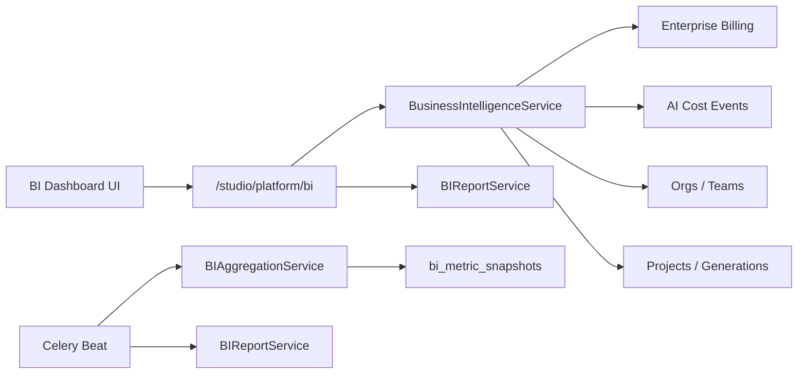

# Business Intelligence

Production-grade BI platform for UNTOLD Studio — unified executive dashboards, revenue, AI costs, usage, performance, org/team/project analytics, retention, growth, custom reports, export, and scheduled delivery.

## Capabilities

| Feature | Status |
|---------|--------|
| Executive Dashboard | Cross-domain KPIs + trends |
| Revenue | MRR, ARR, invoices, plan breakdown |
| AI Costs | Modality/provider breakdown, daily timeseries |
| Usage | Seat, storage, AI credits, video minutes |
| Performance | Success rate, latency, cache hits |
| Projects | Active/completed, stage breakdown |
| Teams | Team roster + member counts |
| Organizations | Org directory + seat utilization |
| Retention | Churn, renewal rate |
| Growth | New orgs/members/projects, MRR growth |
| Custom Reports | User-defined metric sets |
| Export | CSV + JSON download |
| Scheduled Reports | Cron delivery (Celery beat) |

## Architecture

## API (`/api/v1/studio/platform/bi`)

### Dashboards
| Endpoint | Description |
|----------|-------------|
| `GET /catalog` | Metric namespaces + catalog |
| `GET /executive` | Executive summary |
| `GET /revenue` | Revenue & billing KPIs |
| `GET /ai-costs` | AI spend analytics |
| `GET /usage` | Usage meters |
| `GET /performance` | Generation performance |
| `GET /projects` | Production pipeline stats |
| `GET /teams` | Team analytics |
| `GET /organizations` | Organization directory |
| `GET /retention` | Subscription retention |
| `GET /growth` | Growth metrics |

### Reports
| Endpoint | Description |
|----------|-------------|
| `GET/POST /reports` | List / create custom reports |
| `GET/DELETE /reports/{id}` | Get / delete report |
| `POST /reports/{id}/run` | Execute report |
| `GET /reports/{id}/export?format=csv\|json` | Download export |
| `GET/POST /scheduled-reports` | List / create schedules |
| `DELETE /scheduled-reports/{id}` | Remove schedule |

All dashboard endpoints accept optional `days` query param for time range. Organization scope is resolved via `X-Organization-ID` header (tenant context).

## Data warehouse

Migration `044` creates:

- `bi_metric_snapshots` — daily org-level metric rollups
- `bi_report_definitions` — custom + system report templates
- `bi_report_runs` — execution history
- `bi_scheduled_reports` — cron schedules with CSV/JSON export

Daily aggregation: Celery task `untold.aggregate_bi_daily_snapshots` (03:00 UTC).

Scheduled reports: `untold.process_scheduled_bi_reports` (every 15 minutes).

## System report templates

- Executive Summary
- Revenue & Billing
- AI Cost Breakdown
- Usage Meters

## Frontend

Studio → **Business Intelligence** (`/studio/bi`) — tabbed dashboard with export and schedule management.

## Permissions

Requires `analytics.read` studio permission. Organization context via tenant headers.
