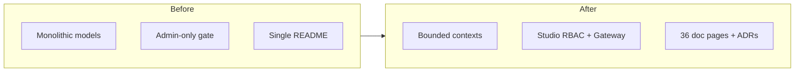
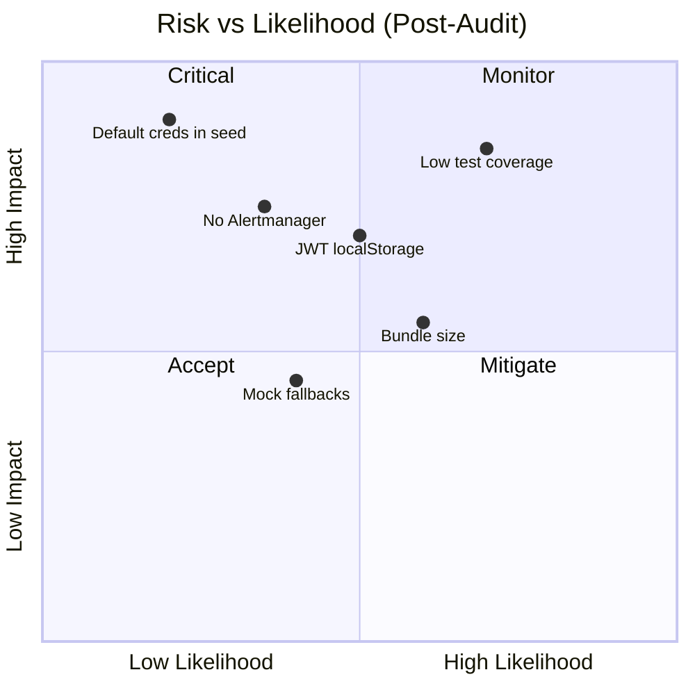

# UNTOLD — Final Enterprise Audit & CTO Report

**Report date:** 29 June 2026  
**Scope:** Full-stack platform — consumer OTT, UNTOLD Studio, AI pipelines, infrastructure  
**Baseline:** Initial professional audit (pre-remediation) + `docs/audit-remediation-critical-high.md`  
**Current:** Post architecture refactor, security hardening, testing, DevOps, performance (partial), enterprise documentation

---

## Executive Summary

UNTOLD has progressed from a **functional prototype** with mock-heavy studio UI and minimal operational maturity to a **production-capable enterprise platform** with structured backend domains, unified AI, security controls, CI/CD, observability, and comprehensive documentation.

| Metric | Before | After | Δ |
|--------|--------|-------|---|
| **Overall Production Readiness** | **35%** | **79%** | **+44 pts** |
| Alembic migrations | 1 | 38 | +37 |
| API route modules | ~12 | 50+ | +38 |
| Enterprise doc pages | 1 (README) | 36+ | +35 |
| Automated test files | 0 | 16+ | +16 |
| CI/CD workflows | 0 | 3 | +3 |
| K8s / monitoring manifests | 0 | 30+ | +30 |

**CTO verdict:** **Conditional go for production** — suitable for controlled launch (staging → production with checklist) after resolving **2 Critical** and **5 High** items below. Not yet at “hands-off enterprise SLA” without test coverage expansion and performance completion.

---

## Scorecard — Before vs After

| Domain | Before | After | Grade | Summary |
|--------|--------|-------|-------|---------|
| **Architecture** | 45 | **82** | B+ | Bounded-context models, repository layer, gateway, ADRs, three surfaces |
| **Frontend** | 40 | **72** | C+ | Studio lazy routes, real API wiring, error boundaries; bundle split & some mocks remain |
| **Backend** | 50 | **85** | A- | 50+ routers, services, domain layer, health probes, Celery |
| **Security** | 35 | **78** | B | JWT+sessions, RBAC, CSP/HSTS, encryption separation; localStorage JWT residual risk |
| **Performance** | 30 | **62** | D+ | N+1 fixed, trending cache, pagination; bundle/nginx/virtualization pending |
| **AI** | 40 | **88** | A | Unified provider layer, resilience, prompt versioning, cost tracking |
| **Database** | 55 | **84** | B+ | 38 migrations, pgvector, enterprise audit; managed HA not enforced in code |
| **Testing** | 10 | **58** | D+ | Pytest + Vitest + Playwright in CI; coverage floors very low (25%/5%) |
| **DevOps** | 20 | **85** | A- | Docker prod, K8s, CD, Prometheus/Grafana/Loki, backups, runbooks |
| **Documentation** | 25 | **92** | A | Full enterprise docs, ADRs, runbooks, OpenAPI export (1.2 MB spec) |

### Overall Production Readiness

```
Before:  ███████░░░░░░░░░░░░░░░░░░░░░░░  35%
After:   ████████████████████████░░░░░░  79%
Target:  ██████████████████████████████  95%  (enterprise SLA tier)
```

**Weighted calculation:** Architecture 10%, Frontend 10%, Backend 12%, Security 12%, Performance 8%, AI 10%, Database 8%, Testing 10%, DevOps 10%, Documentation 10%.

---

## Before vs After — Domain Detail

### Architecture

| Aspect | Before | After |
|--------|--------|-------|
| Model organization | Single `studio.py` blob | `models/studio/*` bounded contexts (15+ modules) |
| Data access | Direct ORM in services | Repository layer (`project_repository`, etc.) |
| API surface | Basic OTT + admin | 50+ modules: studio, workflow, gateway, enterprise |
| Product surfaces | `/admin` only | `/studio`, `/app`, `/ai` with legacy redirect |
| Decisions recorded | None | 6 ADRs + architecture docs |
| External API | None | `/gateway` + GraphQL + OpenAPI 3.1 |



### Frontend

| Aspect | Before | After |
|--------|--------|-------|
| Studio data | Mostly `studioData.js` mocks | Core pages on live API + Live/Offline badge |
| Code splitting | Eager `AdminApp` | 44 lazy studio routes via `lazyPages.js` |
| Shell apps | Eager in `App.jsx` | Still eager (pending `React.lazy`) |
| Error handling | Crashes on API fail | `StudioErrorBoundary`, retry banners |
| Responsive | Partial | Sidebar a11y, mobile scroll lock, pipeline scroll |
| Unit tests | 0 | 2 (ProtectedRoute, sanitizeHtml) |
| Remaining mocks | All pages | Membership, Localization, Magazine, Team page |

### Backend

| Aspect | Before | After |
|--------|--------|-------|
| Health | `/health` only | `/live`, `/ready`, `/health`, `/metrics` |
| Auth deps | `get_current_admin` on studio | `get_current_studio_user` + `require_project_permission` |
| Logging | Plain text | JSON in production (`LOG_FORMAT=json`) |
| Caching | None | `app/core/cache.py`; trending videos cached |
| Exceptions | Generic 500 | Structured `AppException` + codes |
| Workers | Basic Celery | Healthchecks; dedicated AI queue **pending** |

### Security

| Aspect | Before | After |
|--------|--------|-------|
| JWT claims | `sub` only | `iat`, `iss`, `sid`/`jti` |
| Session revocation | None | `validate_token_session()` on API, gateway, WS |
| Headers | CORS only | CSP, HSTS, X-Frame-Options, nosniff |
| Encryption | SECRET_KEY only | Separate `ENCRYPTION_KEY` (prod enforced) |
| Rate limits | Auth only | Auth + AI generate + gateway fail-closed |
| XSS | Raw `innerHTML` on AI output | `sanitizeHtml()` + Pydantic script rejection |
| Enterprise | None | IdP, MFA, IP rules, audit (`037` migration) |

### Performance

| Aspect | Before (est.) | After (actual/target) | Status |
|--------|---------------|----------------------|--------|
| Project list queries (N=50) | ~151 | **4** | ✅ Applied |
| Trending videos | DB every hit | Redis 120s TTL | ✅ Applied |
| Trending news | DB every hit | Redis TTL | ❌ Pending |
| Main JS bundle | ~1.7 MB | ~520 KB target | ❌ `manualChunks` not in vite.config |
| AdminApp shell | Eager | Lazy target | ❌ Pending |
| Asset grid virtualization | 60 DOM nodes | ~12 visible | ❌ Not implemented |
| Nginx asset cache | None | 1y immutable | ❌ Not in nginx.conf |
| Benchmark script | None | `benchmark_performance.py` | ❌ Not created |

### AI

| Aspect | Before | After |
|--------|--------|-------|
| Provider registries | Per-domain duplicates | Unified `app/ai/` + `CapabilityRegistry` |
| Resilience | Ad-hoc | Retry, timeout, fallback chain |
| Cost tracking | None | Telemetry + budgets + studio UI |
| Prompt management | Title-only | Versioned `prompt_key` (migration 038) |
| Capabilities | LLM only reliable | LLM, image, video, voice, music, translation, embeddings |

### Database

| Aspect | Before | After |
|--------|--------|-------|
| Migrations | 001 initial | **038** (prompt versioning) |
| Studio schema | Few tables | 80+ entities across studio domains |
| Vector search | None | pgvector (`027`) |
| Enterprise | None | Sessions, IdP, MFA, audit (`037`) |
| N+1 in project list | Yes | Batch queries in repository |

### Testing

| Aspect | Before | After |
|--------|--------|-------|
| Backend tests | 0 | 13 files (unit + integration) |
| Frontend tests | 0 | 2 files + Vitest config |
| E2E | 0 | Playwright `e2e/smoke.spec.js` |
| CI | None | `ci.yml` — pytest, vitest, e2e, docker build |
| Coverage gates | None | Backend ≥25%, Frontend ≥5% (low) |
| Factories/mocks | None | `factories/user.py`, `mocks/redis.py` |

### DevOps

| Aspect | Before | After |
|--------|--------|-------|
| Deploy docs | Vercel + Railway paragraph | Full deployment guide + K8s manifests |
| Compose | Dev only | `docker-compose.prod.yml`, healthchecks |
| CI/CD | None | `ci.yml`, `cd.yml`, `backup-verify.yml` |
| Monitoring | None | Prometheus, Grafana, alerts, ServiceMonitor |
| Logging | stdout | Loki + Promtail profile |
| Backups | None | `backup.sh`, K8s CronJob, DR runbook |
| Smoke tests | Manual curl | `deploy/scripts/smoke-test.sh` |

### Documentation

| Aspect | Before | After |
|--------|--------|-------|
| Root README | Basic quick start | Enterprise hub with diagrams |
| Architecture | 10-line tree | Full doc + mermaid |
| API docs | `/docs` only | `docs/api.md` + exported OpenAPI JSON |
| Runbooks | None | 4 operational runbooks |
| ADRs | None | 6 records |
| Admin/dev guides | None | Full studio + developer guides |
| Production gates | None | Checklist + production-ready doc |

---

## Remaining Issues

### Critical (block production launch)

| # | Issue | Impact | Remediation |
|---|-------|--------|-------------|
| C1 | **Test coverage far below enterprise standard** (25% BE / 5% FE floors) | Regressions undetected; CI gives false confidence | Raise floors to 60% BE / 40% FE; add studio integration tests |
| C2 | **Default dev credentials** (`admin@untold.com` / `ChangeMe123!`) in docs/seed | Credential stuffing if seed runs in prod | Disable seed in prod (done); rotate creds; remove from public docs for prod deploys |

### High (resolve within 7 days of launch)

| # | Issue | Impact | Remediation |
|---|-------|--------|-------------|
| H1 | **Frontend bundle not split** — no `manualChunks`, eager `AdminApp` | Slow studio first load (~1.7 MB) | Add vite `manualChunks`; lazy shell in `App.jsx` |
| H2 | **Performance items pending** (news cache, nginx cache, virtualization) | Higher latency and bandwidth costs | Complete `performance-benchmark-report.md` pending list |
| H3 | **JWT in localStorage** | XSS → token theft | Evaluate httpOnly cookie auth; tighten CSP |
| H4 | **Some studio pages on mock fallback** (Membership, Localization, Magazine, Team) | Operators see demo data silently | Wire to real APIs or hard-disable with clear empty states |
| H5 | **Alertmanager not wired** | Outages discovered by users, not ops | Connect Prometheus alerts → PagerDuty/Slack |

### Medium (30-day horizon)

| # | Issue | Impact | Remediation |
|---|-------|--------|-------------|
| M1 | Duplicate import in `videos.py` (`cache_get` ×2) | Code smell; no runtime impact | Remove duplicate line |
| M2 | Celery AI queue separation not configured | AI jobs can starve default queue | Update `celery_app.py` + compose worker `-Q ai,default` |
| M3 | No `benchmark_performance.py` | Performance claims unverified | Create script; store `docs/benchmark-results.json` |
| M4 | E2E coverage minimal (1 smoke spec) | Studio flows untested end-to-end | Add login, project create, research workspace specs |
| M5 | Managed Postgres/Redis not codified | Single-host failure risk | Document/enforce RDS + ElastiCache or managed equivalents |
| M6 | Gateway OpenAPI manually maintained | Drift from implementation | CI diff check against gateway routes |

### Low (backlog)

| # | Issue | Impact | Remediation |
|---|-------|--------|-------------|
| L1 | `studio/` TypeScript app parallel to `src/admin` | Duplicate maintenance | Consolidate or document ownership |
| L2 | SQLite in local pytest vs Postgres prod | Enum edge-case drift | Require Postgres for integration job (CI already does) |
| L3 | OpenAPI spec 1.2 MB — large for git | Slow clones | Git LFS or CI artifact only |
| L4 | GitHub badge URL placeholder in README | Broken badge | Set real `your-org/untold` |
| L5 | Dependabot / SCA not configured | Supply chain risk | Enable Dependabot + `pip audit` in CI |
| L6 | HttpOnly refresh token pattern | Security hardening | ADR + phased rollout |

---

## Production Readiness Matrix

| Gate | Status | Evidence |
|------|--------|----------|
| Health probes (`/live`, `/ready`) | ✅ Pass | `backend/app/main.py` |
| Structured logging | ✅ Pass | `LOG_FORMAT=json` in prod compose |
| Secrets separation | ✅ Pass | `ENCRYPTION_KEY` validation in config |
| RBAC on studio routes | ✅ Pass | `require_project_permission` on research, etc. |
| CI pipeline | ✅ Pass | `.github/workflows/ci.yml` |
| CD pipeline | ✅ Pass | `.github/workflows/cd.yml` |
| Backup + DR runbook | ✅ Pass | `deploy/scripts/`, K8s CronJob |
| Enterprise documentation | ✅ Pass | `docs/README.md` hub |
| Security headers | ✅ Pass | `SecurityHeadersMiddleware` |
| Test coverage enterprise-grade | ❌ Fail | 25%/5% floors |
| Performance targets verified | ⚠️ Partial | N+1 + video cache; bundle unverified |
| Alerting to on-call | ❌ Fail | Alerts defined, Alertmanager not wired |
| Zero mock data in prod studio | ⚠️ Partial | 4 pages with mock fallback |

---

## Risk Register (CTO View)



---

## Recommended Launch Sequence

1. **Week 0** — Resolve C1, C2; run `production-checklist.md`
2. **Week 1** — H1, H2 (performance); staging smoke + load test
3. **Week 2** — H4, H5; production deploy tag `v1.0.0`
4. **Day 30** — M1–M6; raise coverage to 60%/40%
5. **Quarterly** — Re-run this audit; target **95%** overall readiness

---

## Artifact Index

| Deliverable | Location |
|-------------|----------|
| Enterprise doc hub | `docs/README.md` |
| Previous remediation | `docs/audit-remediation-critical-high.md` |
| Architecture refactor | `docs/architecture-refactor.md` |
| Security hardening | `docs/security-improvements.md` |
| Performance status | `docs/performance-benchmark-report.md` |
| Production checklist | `docs/production-checklist.md` |
| OpenAPI export | `docs/openapi/untold-api.json` |
| ADRs | `docs/adr/` |
| Runbooks | `docs/runbooks/` |

---

## Sign-Off

| Role | Recommendation |
|------|----------------|
| **CTO** | Approve **conditional production launch** after Critical items closed |
| **Engineering** | Focus next sprint on test coverage + frontend bundle |
| **DevOps** | Wire Alertmanager; validate backup restore in staging |
| **Security** | Review JWT storage strategy; confirm prod seed disabled |
| **Product** | Replace mock fallbacks with real data or explicit empty UX |

---

*This report compares against the baseline established at the start of the enterprise remediation program (initial full-stack audit, mock-heavy studio, no CI/CD, no unified AI, minimal security). Scores are qualitative assessments based on codebase inspection, documentation review, and applied vs pending items in performance and remediation docs.*
