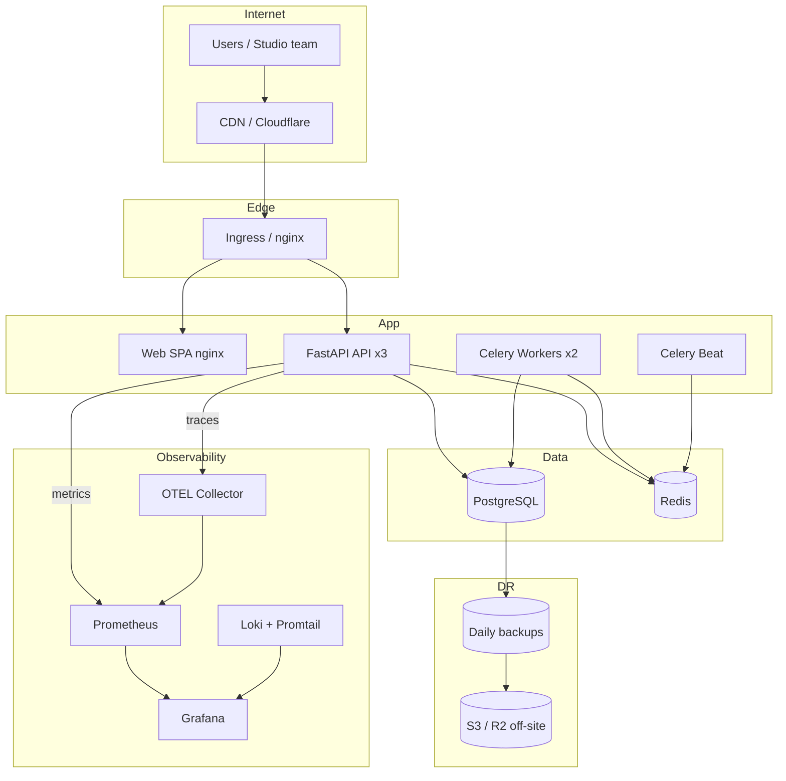

# UNTOLD Production Deployment Guide

Complete guide for deploying UNTOLD to production with Docker Compose or Kubernetes.

## Architecture



## Environment Strategy

| Environment | Purpose | Compose / K8s | Secrets | Data |
|-------------|---------|---------------|---------|------|
| **Development** | Local dev | `docker-compose.yml` | `.env` from `development.env.example` | Ephemeral volumes |
| **Staging** | Pre-prod validation | K8s or compose + prod overrides | GitHub `staging` env secrets | Shared staging DB |
| **Production** | Live traffic | K8s (recommended) or compose prod | K8s Secrets / vault | HA Postgres, daily backups |

### Required secrets (production)

| Secret | Source | Notes |
|--------|--------|-------|
| `SECRET_KEY` | `openssl rand -hex 32` | JWT signing |
| `ENCRYPTION_KEY` | `openssl rand -hex 32` | Must differ from SECRET_KEY |
| `POSTGRES_PASSWORD` | Strong random | DB + DATABASE_URL |
| `GRAFANA_ADMIN_PASSWORD` | Strong random | Monitoring UI |
| Vendor API keys | Provider consoles | OpenAI, Stripe, etc. |

Never commit filled `.env` or `secrets.yaml`. Use:
- **Docker Compose:** `.env` file (gitignored)
- **Kubernetes:** `deploy/kubernetes/secrets.yaml` (gitignored) or External Secrets Operator
- **CI/CD:** GitHub Environment secrets (`KUBECONFIG_*`, `STAGING_API_URL`)

---

## Deployment Strategies

### Strategy A — Docker Compose (single host / VM)

Best for: early production, single-region, ops team < 3.

```bash
cp deploy/env/production.env.example .env
# Fill SECRET_KEY, ENCRYPTION_KEY, POSTGRES_PASSWORD, CORS_ORIGINS

docker compose -f docker-compose.yml -f docker-compose.prod.yml up -d --build

# Monitoring
docker compose -f docker-compose.yml -f docker-compose.monitoring.yml --profile monitoring up -d

# Logging (optional)
docker compose -f docker-compose.yml -f docker-compose.logging.yml --profile logging up -d

# Daily backups
docker compose -f docker-compose.yml -f docker-compose.prod.yml --profile backup up -d backup
```

**Rolling updates:** `docker compose up -d --build api web` — brief downtime on single node.

### Strategy B — Kubernetes (recommended production)

Best for: HA, autoscaling, multi-region path.

```bash
cp deploy/kubernetes/secrets.example.yaml deploy/kubernetes/secrets.yaml
# Edit secrets.yaml

kubectl apply -k deploy/kubernetes
kubectl rollout status deployment/untold-api -n untold
```

**Deployment model:** Rolling updates (default `maxUnavailable: 25%`).
**Production releases:** Git tag `v*.*.*` triggers CD → GHCR → kubectl set image.
**Rollback:** `kubectl rollout undo deployment/untold-api -n untold`

### Strategy C — Hybrid

- **Frontend:** Vercel / Cloudflare Pages (static)
- **API:** Railway / Fly / K8s
- **DB:** Managed Postgres (RDS, Neon, Supabase)

Set `VITE_API_URL` at build time; point `CORS_ORIGINS` to frontend domain.

---

## CI/CD Pipeline

| Workflow | Trigger | Actions |
|----------|---------|---------|
| `ci.yml` | PR / push to `main`, `develop` | Tests, lint, build, Docker build verify |
| `cd.yml` | Push `main` | Build & push GHCR → deploy staging → smoke test |
| `cd.yml` | Tag `v*.*.*` | Build & push → deploy production → smoke test |
| `backup-verify.yml` | Weekly | Backup/restore script validation |

### GitHub configuration

**Repository secrets:**
- `KUBECONFIG_STAGING` — base64-encoded kubeconfig
- `KUBECONFIG_PRODUCTION` — base64-encoded kubeconfig

**Environment variables:**
- `STAGING_API_URL` — e.g. `https://staging-api.untold.com`
- `PRODUCTION_API_URL` — e.g. `https://api.untold.com`

---

## Health Checks

| Endpoint | Purpose | K8s probe |
|----------|---------|-----------|
| `GET /live` | Process alive | **Liveness** |
| `GET /ready` | DB + Redis up | **Readiness** / startup |
| `GET /health` | Full status (public) | Load balancer |
| `GET /metrics` | Prometheus scrape | — |

```bash
./deploy/scripts/smoke-test.sh
# API_URL=https://api.untold.com WEB_URL=https://untold.com ./deploy/scripts/smoke-test.sh
```

---

## Monitoring & Alerting

```bash
docker compose -f docker-compose.yml -f docker-compose.monitoring.yml --profile monitoring up -d
```

| Service | URL | Credentials |
|---------|-----|-------------|
| Prometheus | `:9090` | — |
| Grafana | `:3000` | `GRAFANA_ADMIN_*` from `.env` |
| API metrics | `/metrics` | Scraped by Prometheus |

**Alerts** (`deploy/monitoring/prometheus/alerts.yml`):
- `UntoldApiDown` — scrape failure 2m
- `HighErrorRate` — 5xx > 5% for 5m
- `HighLatencyP95` — p95 > 2s for 10m

Wire Alertmanager in `prometheus.yml` for PagerDuty/Slack.

---

## Logging

Production API emits **JSON logs** when `LOG_FORMAT=json` (set in `docker-compose.prod.yml`).

Centralized stack:
```bash
docker compose -f docker-compose.yml -f docker-compose.logging.yml --profile logging up -d
```
View logs in Grafana → Explore → Loki.

---

## Backups & Disaster Recovery

| Metric | Target |
|--------|--------|
| **RPO** | 24 hours (daily backups) |
| **RTO** | 4 hours |

```bash
# Manual backup
./deploy/scripts/backup.sh

# Off-site (set in .env)
BACKUP_S3_URI=s3://your-bucket/untold-backups

# Restore (destructive)
./deploy/scripts/restore.sh /backups/untold_YYYYMMDD_HHMMSS.sql.gz

# DR checklist
./deploy/scripts/dr-runbook.sh
```

**Kubernetes:** `deploy/kubernetes/backup-cronjob.yaml` runs daily at 03:00 UTC.

---

## Docker Production Hardening

Applied in `docker-compose.prod.yml`:
- No exposed DB/Redis ports
- Resource limits (CPU/memory)
- JSON log rotation (`max-size: 50m`, `max-file: 5`)
- `restart: always`
- Redis `maxmemory-policy allkeys-lru`
- Celery worker replicas: 2

---

## Post-Deploy Verification

```bash
curl -fsS https://api.untold.com/live
curl -fsS https://api.untold.com/ready
curl -fsS https://api.untold.com/health
curl -fsS https://api.untold.com/metrics | head
```

See [production-checklist.md](./production-checklist.md) for the full gate list.

---

## Related docs

- [infrastructure/README.md](./infrastructure/README.md) — quick reference
- [security-improvements.md](./security-improvements.md) — security hardening
- [testing-guide.md](./testing-guide.md) — CI test gates
