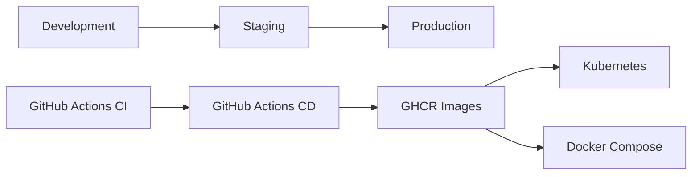

# Deployment

Production deployment guide for UNTOLD. For the full operational manual, see **[Deployment Guide](./deployment-guide.md)**.

## Quick reference



## Environments

| Environment | Purpose | Config template |
|-------------|---------|-----------------|
| Development | Local work | `deploy/env/development.env.example` |
| Staging | Pre-prod validation | `deploy/env/staging.env.example` |
| Production | Live traffic | `deploy/env/production.env.example` |

| Setting | Development | Production |
|---------|-------------|------------|
| `DEBUG` | `true` | `false` |
| `ENVIRONMENT` | `development` | `production` |
| `SEED_DATABASE` | `true` (optional) | `false` |
| `LOG_FORMAT` | `text` | `json` |
| API docs | Enabled | Disabled |
| DB/Redis ports | Exposed | Internal only |

## Deployment strategies

### A — Docker Compose (single host)

```bash
cp deploy/env/production.env.example .env
docker compose -f docker-compose.yml -f docker-compose.prod.yml up -d --build
./deploy/scripts/smoke-test.sh
```

Add monitoring and logging profiles as needed — see [Infrastructure](./infrastructure/README.md).

### B — Kubernetes (recommended)

```bash
cp deploy/kubernetes/secrets.example.yaml deploy/kubernetes/secrets.yaml
kubectl apply -k deploy/kubernetes
kubectl rollout status deployment/untold-api -n untold
```

Manifests: `deploy/kubernetes/` — API, web, workers, ingress, HPA, backups, ServiceMonitor.

### C — Hybrid

- Frontend: Vercel / Cloudflare Pages (`npm run build`)
- API: Railway / Fly / K8s
- DB: Managed Postgres (RDS, Neon, Supabase)

Set `VITE_API_URL` at build time; align `CORS_ORIGINS`.

## CI/CD

| Workflow | Trigger | Actions |
|----------|---------|---------|
| `ci.yml` | PR / push | Lint, test, build, Docker verify |
| `cd.yml` | `main` | Build → GHCR → staging deploy → smoke |
| `cd.yml` | Tag `v*.*.*` | Build → GHCR → production deploy → smoke |
| `backup-verify.yml` | Weekly | Backup script validation |

### Required GitHub secrets

| Secret | Purpose |
|--------|---------|
| `KUBECONFIG_STAGING` | Base64 kubeconfig |
| `KUBECONFIG_PRODUCTION` | Base64 kubeconfig |
| `STAGING_API_URL` | Smoke test target |
| `PRODUCTION_API_URL` | Smoke test target |

## Health checks

| Endpoint | Probe type |
|----------|------------|
| `GET /live` | Liveness |
| `GET /ready` | Readiness (DB + Redis) |
| `GET /health` | Load balancer / status page |
| `GET /metrics` | Prometheus scrape |

```bash
API_URL=https://api.yourdomain.com ./deploy/scripts/smoke-test.sh
```

## Secrets management

| Secret | Generation |
|--------|------------|
| `SECRET_KEY` | `openssl rand -hex 32` |
| `ENCRYPTION_KEY` | `openssl rand -hex 32` (must differ) |
| `POSTGRES_PASSWORD` | Strong random |
| `GRAFANA_ADMIN_PASSWORD` | Strong random |

Never commit `.env` or `secrets.yaml`. Use K8s Secrets, GitHub Environments, or External Secrets Operator.

## Monitoring & logging

```bash
# Metrics
docker compose -f docker-compose.yml -f docker-compose.monitoring.yml --profile monitoring up -d

# Logs
docker compose -f docker-compose.yml -f docker-compose.logging.yml --profile logging up -d
```

Alerts: `deploy/monitoring/prometheus/alerts.yml`

## Backups & DR

| Metric | Target |
|--------|--------|
| RPO | 24 hours |
| RTO | 4 hours |

```bash
./deploy/scripts/backup.sh
BACKUP_S3_URI=s3://bucket/untold-backups ./deploy/scripts/backup.sh
./deploy/scripts/dr-runbook.sh
```

## Rollback

**Kubernetes:**
```bash
kubectl rollout undo deployment/untold-api -n untold
kubectl rollout undo deployment/untold-web -n untold
```

**Compose:**
```bash
docker compose -f docker-compose.yml -f docker-compose.prod.yml up -d --build api@previous
```

See [Runbooks: Deployment Rollback](./runbooks/deployment-rollback.md).

## Related documents

- [Deployment Guide](./deployment-guide.md) — full guide with architecture diagram
- [Production Checklist](./production-checklist.md)
- [Production Ready](./production-ready.md)
- [Infrastructure](./infrastructure/README.md)
- [Runbooks](./runbooks/README.md)
