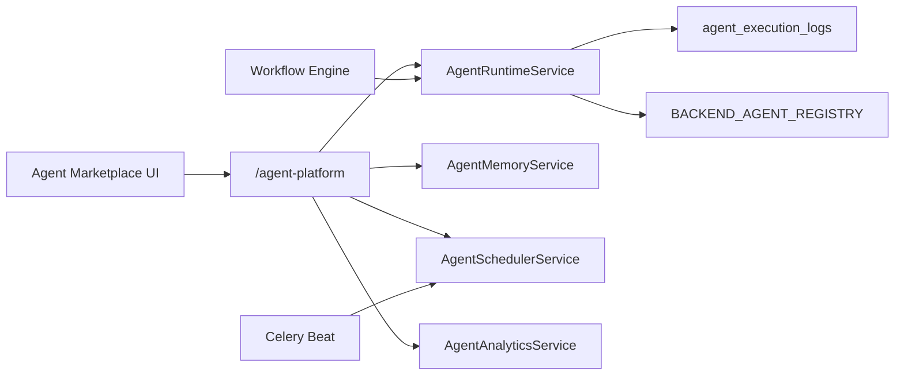

# Enterprise AI Agent Platform

Production-grade agent runtime for UNTOLD Studio — registry, marketplace integration, SDK, permissions, memory, inter-agent messaging, scheduling, monitoring, analytics, and execution logs.

## Capabilities

| Feature | Status |
|---------|--------|
| Agent Registry | System catalog + backend handler registry |
| Agent Marketplace | Install, enable, configure, permissions (existing) |
| Agent SDK | `BaseAgent` + `AgentContext` (backend), `src/agent-sdk` (frontend) |
| Agent Permissions | Granular grants per installation |
| Agent Memory | Key-value persistent memory per installation/project |
| Agent Communication | Inter-agent messages (`agent_messages`) |
| Agent Scheduling | Per-installation cron (Celery beat) |
| Agent Monitoring | Overview dashboard metrics |
| Agent Analytics | Per-installation totals + daily breakdown |
| Agent Logs | Durable `agent_execution_logs` |

## Architecture



## API (`/api/v1/studio/platform/agent-platform`)

### Platform
| Endpoint | Description |
|----------|-------------|
| `GET /registry` | Catalog + registered handlers + permission list |
| `GET /sdk` | SDK documentation payload |
| `POST /register` | Register custom marketplace agent (admin) |
| `GET /monitoring` | Monitoring overview (runs, failures, cost, messages) |
| `GET /logs` | Paginated execution logs |

### Per installation
| Endpoint | Description |
|----------|-------------|
| `GET /installations/{id}/analytics` | Lifetime run/cost/token totals |
| `POST /installations/{id}/run` | Manual agent execution |
| `GET/PUT /installations/{id}/memory` | List / upsert memory entries |
| `DELETE /installations/{id}/memory/{mid}` | Delete memory entry |
| `GET/POST /installations/{id}/schedules` | List / create cron schedules |
| `DELETE /installations/{id}/schedules/{sid}` | Delete schedule |
| `GET/POST /installations/{id}/messages` | List / send inter-agent messages |
| `POST /installations/{id}/messages/{mid}/read` | Mark message read |

## Backend SDK

```python
from app.agents.sdk.base import BaseAgent, AgentContext
from app.domain.agents.registry import register_agent_class

class MyAgent(BaseAgent):
    slug = "my-agent"

    def on_run(self, ctx: AgentContext, payload: dict) -> dict:
        if not ctx.has_permission("ai.generate"):
            return {"skipped": True}
        return {"status": "ok"}

register_agent_class(MyAgent)
```

### Lifecycle hooks
- `on_install`, `on_enable`, `on_disable` — installation lifecycle
- `on_run` — manual run, scheduled run, or custom dispatch
- `on_message` — inter-agent message handler

## Permissions

| Permission | Capability |
|------------|------------|
| `ai.generate` | Run AI / workflow-gated steps |
| `memory.read` / `memory.write` | Agent memory |
| `communicate.send` / `communicate.receive` | Inter-agent messaging |
| `schedule.manage` | Cron schedules |
| `analytics.read` | View logs and analytics |
| `publish.dispatch` | Publishing actions |
| `project.read` / `project.write` | Project data access |

## Workflow integration

Workflow steps mapped to marketplace agents (`research`, `seo`, `translation`, `voice`, `publishing`) require an **enabled installation** with `ai.generate`. Provider overrides come from agent config (`{step}_provider` or `provider`).

Each completed workflow step writes an `agent_execution_log` row.

## Scheduling

Celery beat task `untold.process_agent_schedules` runs every minute and executes due `agent_schedules` rows via registered `on_run` handlers.

## Database (migration `043`)

- `agent_execution_logs` — run telemetry
- `agent_memory_entries` — persistent memory
- `agent_schedules` — cron schedules
- `agent_messages` — inter-agent queue
- `agent_installations.organization_id` — org scope

## Frontend

- **Agent Marketplace** — install/configure agents; drawer tabs for Memory, Schedules, Logs
- **`src/agent-sdk`** — manifest helpers and event constants

## Sample handlers

| Slug | Handler |
|------|---------|
| `research` | `ResearchMemoryAgent` — stores/recalls last research topic |
| `publishing` | `PublishingAgentHandler` — simulates publish dispatch |
