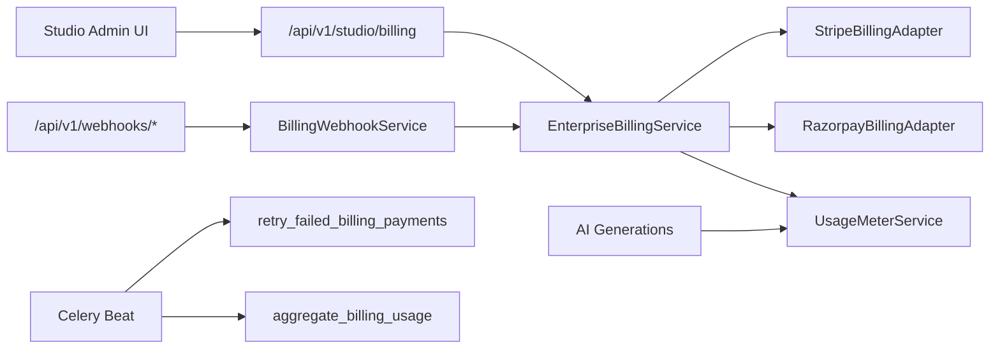

# Enterprise Billing

Production-grade organization billing for UNTOLD Studio: Stripe and Razorpay, subscription plans, invoices, taxes, coupons, credits, usage-based meters, webhooks, and automated payment retries.

## Architecture



## Data model

| Table | Purpose |
|-------|---------|
| `billing_plans` | Plan catalog (free, starter, pro, enterprise) |
| `organization_subscriptions` | One subscription per organization |
| `organization_invoices` | Line-item invoices with tax and credits |
| `organization_billing_payments` | Payment attempts and history |
| `billing_refunds` | Refund records |
| `billing_coupons` | Percent or fixed discounts |
| `billing_credits` | Account credit balances |
| `billing_tax_rates` | Country/region tax rates |
| `usage_meter_records` | Monthly meters: seats, AI credits, storage GB, video minutes |
| `billing_webhook_events` | Idempotent webhook log |

Migration: `040_enterprise_billing.py` (depends on `039_multi_tenant_saas`).

## API (`/api/v1/studio/billing`)

Requires Studio auth and `X-Organization-ID` header. Billing mutations require `org.billing` permission.

| Method | Path | Description |
|--------|------|-------------|
| GET | `/plans` | List active plans |
| GET | `/subscription` | Current org subscription |
| POST | `/subscribe` | Create or upgrade subscription |
| PATCH | `/subscription` | Change plan, seats, cancellation |
| GET | `/invoices` | Invoice history |
| GET | `/payments` | Payment history |
| POST | `/payments/{id}/refund` | Issue refund |
| POST | `/coupons/validate` | Validate coupon code |
| GET/POST | `/credits` | List or apply account credits |
| GET | `/usage` | Usage summary and overage estimate |
| POST | `/usage` | Record usage meter increment |

Consumer OTT payments remain at `/api/v1/payments` (separate tables).

## Payment providers

### Stripe

- Org customers created with `organization_id` metadata
- Subscriptions use plan `stripe_price_id` or `STRIPE_DEFAULT_PRICE_ID`
- Webhooks: `invoice.payment_succeeded`, `invoice.payment_failed`, `customer.subscription.deleted`

### Razorpay

- Orders for one-time invoice collection
- Webhooks: `subscription.charged`, `payment.failed`
- Signature verified via `X-Razorpay-Signature`

Webhooks are unified at `/api/v1/webhooks/stripe` and `/api/v1/webhooks/razorpay`. `BillingWebhookService` delegates consumer events to `PaymentService` and processes org billing events with idempotency via `billing_webhook_events`.

## Usage-based billing

Meters tracked per organization per calendar month (`period_key` = `YYYY-MM`):

| Meter | Source |
|-------|--------|
| `seats` | Synced from `organization.seats_used` |
| `storage_gb` | Synced from `organization.storage_used_bytes` |
| `ai_credits` | AI generations via `record_generation_cost` (~1 credit per 1k tokens) |
| `video_minutes` | Record via API or pipeline hooks |

Overage is estimated from plan `usage_rates` JSON (cents per unit).

Celery task `untold.aggregate_billing_usage` runs daily at 02:00 UTC to sync seats and storage for all active orgs.

## Failed payment retry

When a payment fails:

1. Subscription status → `past_due`
2. `failed_payment_count` incremented
3. `next_retry_at` scheduled (1–5 days backoff)

Celery task `untold.retry_failed_billing_payments` runs every 6 hours and retries open Stripe invoices.

## Configuration

```env
STRIPE_SECRET_KEY=sk_live_...
STRIPE_WEBHOOK_SECRET=whsec_...
STRIPE_DEFAULT_PRICE_ID=price_...
RAZORPAY_KEY_ID=rzp_...
RAZORPAY_KEY_SECRET=...
RAZORPAY_WEBHOOK_SECRET=...
```

Without provider keys, adapters return mock IDs for local development.

## Plans (seeded)

| Slug | Seats | AI credits | Storage | Video min |
|------|-------|------------|---------|-----------|
| `studio-free` | 3 | 100 | 5 GB | 60 |
| `studio-starter` | 10 | 1,000 | 50 GB | 500 |
| `studio-pro` | 25 | 10,000 | 500 GB | 5,000 |
| `studio-enterprise` | 100 | 100,000 | 5 TB | 50,000 |

## Tax

Tax rates seeded for US (8%), IN (18% GST), GB (20% VAT). Applied at subscribe time based on `country` in request body.

## Rollout

1. Run `alembic upgrade head` through `040_enterprise_billing`
2. Configure Stripe/Razorpay keys and webhook endpoints
3. Map `stripe_price_id` on each `billing_plans` row in production
4. Enable Celery worker + beat for retry and usage aggregation
5. Point Stripe/Razorpay webhooks to `/api/v1/webhooks/*`

## Related docs

- [Multi-tenant SaaS](./multi-tenant-saas.md)
- [ADR 0007 — Multi-tenant SaaS](./adr/0007-multi-tenant-saas.md)
