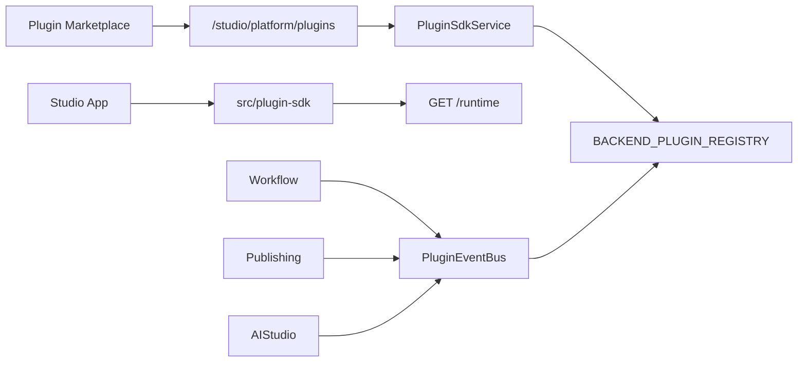

# Enterprise Plugin Marketplace

Production-grade plugin platform for UNTOLD Studio — SDK, marketplace, install/update lifecycle, permissions, hooks, events, frontend and backend plugins, ratings, versioning, and documentation.

## Capabilities

| Feature | Status |
|---------|--------|
| Plugin SDK | Backend `BasePlugin` + frontend `createPlugin` / `PluginProvider` |
| Install / Update / Uninstall | Full lifecycle with history |
| Permissions | Per-installation grants + validation |
| Hooks | Backend `run_hooks` + frontend `usePluginHooks` |
| Events | `PluginEventBus` + frontend `dispatchEvent` |
| Frontend Plugins | Bundled samples + runtime activation |
| Backend Plugins | Python registry + lifecycle handlers |
| Marketplace | Catalog, search, categories, install counts |
| Ratings | 1–5 stars + reviews per plugin |
| Versioning | Integer versions + semver labels + changelog |
| Documentation | In-app docs page + `GET /docs` + hooks/events catalogs |

## Architecture



## API (`/api/v1/studio/platform/plugins`)

| Endpoint | Description |
|----------|-------------|
| `GET /overview` | Marketplace stats + recent events |
| `GET /catalog` | Browse plugins (`category`, `search`) |
| `GET /catalog/{slug}` | Plugin detail |
| `GET /catalog/{slug}/versions` | Version history |
| `GET/POST /catalog/{slug}/ratings` | List / submit ratings |
| `POST /catalog/{slug}/install` | Install plugin |
| `POST /catalog/{slug}/publish-version` | Publish new version (admin) |
| `POST /installations/{id}/update` | Update installation |
| `GET /installations/{id}/history` | Install/update history |
| `GET /hooks` | Hook point catalog |
| `GET /events` | Event catalog |
| `GET /docs` | SDK documentation |
| `GET /runtime` | Frontend runtime manifest |
| `POST /register` | Register community plugin |

## Backend SDK

```python
from app.plugins.sdk.base import BasePlugin, PluginContext

class MyPlugin(BasePlugin):
    slug = "my-plugin"

    def on_install(self, ctx: PluginContext) -> None: ...
    def on_update(self, ctx: PluginContext, from_version: int, to_version: int) -> None: ...
    def on_event(self, ctx, event_name, payload) -> dict | None: ...
    def on_hook(self, ctx, hook_name, payload) -> dict | None: ...
```

Register in `BACKEND_PLUGIN_REGISTRY`.

## Frontend SDK

```javascript
import { createPlugin, HOOKS } from '@/plugin-sdk';

createPlugin({
  manifest: { slug: 'my-plugin', hooks: [HOOKS.DASHBOARD_WIDGETS] },
  setup(api) {
    api.onHook(HOOKS.DASHBOARD_WIDGETS, () => ({ widgets: [...] }));
  },
});
```

Wrap app in `PluginProvider`; use `usePluginHooks('dashboard.widgets')` in pages.

## Events wired in production

| Event | Source |
|-------|--------|
| `workflow.run.started` | Graph workflow executor |
| `workflow.run.finished` | Graph workflow executor |
| `workflow.node.completed` | Graph workflow executor |
| `publish.completed` | Publishing agent |
| `publish.failed` | Publishing agent |
| `ai.job.completed` | AI studio service |
| `collab.comment.created` | Collaboration service |
| `plugin.installed` | Plugin install |

## Database (migration `045`)

- `plugin_ratings` — user ratings and reviews
- `plugin_installations.organization_id` — org scope
- `plugin_versions.version_label` — semver display
- `plugin_definitions` — `documentation_url`, `install_count`, `average_rating`, `rating_count`

## Sample plugins

| Slug | Type | Hooks / Events |
|------|------|----------------|
| `slack-notify` | Backend + Frontend | publish, workflow, collab events |
| `custom-seo-formatter` | Backend + Frontend | SEO format hooks |
| `workflow-logger` | Frontend | after_node hook |
| `dashboard-widgets` | Frontend | dashboard.widgets hook |

## Frontend

Studio → **Plugin Marketplace** (`/studio/plugins`) — search, ratings, version history, permissions, scheduled events log.

Dashboard integrates `dashboard.widgets` hook via `PluginDashboardWidgets`.
