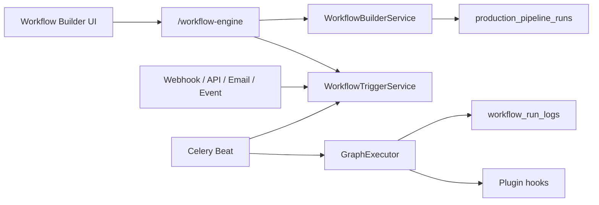

# Enterprise Workflow Automation

Production-grade visual workflow builder for UNTOLD Studio — graph execution with conditions, loops, parallel branches, scheduling, multi-trigger ingress, approvals, notifications, durable execution logs, and version history.

## Capabilities

| Feature | Status |
|---------|--------|
| Visual workflow builder | React Flow canvas + node palette + inspector |
| Conditions | Expression evaluator (`field`, `!field`, `&&`, `\|\|`, `topic=…`) |
| Loops | `loop` node with `max_iterations` + `until_field` |
| Parallel tasks | `parallel` node with thread pool execution |
| Scheduling | `scheduled_at` on runs + cron triggers (Celery beat) |
| Triggers | Manual, webhook, API key, email, cron, domain events |
| Approvals | Run-level + in-graph `approval` nodes |
| Notifications | `notification` control node + `StudioNotification` |
| Execution logs | Durable `workflow_run_logs` table + JSON buffer |
| Version history | Immutable versions + restore (creates new version) |
| Templates | System templates (documentary, shorts, translation review) |

## Architecture

## API (`/api/v1/studio/platform/workflow-engine`)

### Definitions & versions
- `GET/POST /definitions` — list / create
- `GET/PATCH/DELETE /definitions/{id}`
- `GET/POST /definitions/{id}/versions`
- `POST /definitions/{id}/versions/{vid}/restore` — rollback via new version
- `POST /definitions/{id}/execute` — manual run
- `GET /templates`, `POST /templates/{id}/clone`

### Triggers
- `GET/POST /definitions/{id}/triggers`
- `PATCH/DELETE /definitions/{id}/triggers/{tid}`
- `POST /definitions/{id}/triggers/{tid}/fire` — manual fire (auth)

### Public ingress (no session auth)
| Endpoint | Trigger type |
|----------|--------------|
| `POST /webhooks/{secret}` | Webhook |
| `POST /api/trigger` + `X-Workflow-API-Key` | API |
| `POST /email/{token}` | Email (`subject`, `body`, `topic`) |
| `POST /events/{event_name}` | Event (matches `config.event_name`) |

### Runs & logs
- Run lifecycle: `/runs`, `/runs/{id}/run`, `/approve`, `/reject`, `/cancel`, `/retry`
- `GET /runs/{id}/execution-logs` — paginated durable logs (filter by `level`, `node_id`)

## Control nodes

| Node | Behavior |
|------|----------|
| `condition` | Branch on expression (`true`/`false` handles) |
| `loop` | Repeat body up to `max_iterations` until field satisfied |
| `parallel` | Execute outgoing branches concurrently |
| `delay` | In-run sleep (`delay_seconds`) |
| `approval` | Pause run until reviewer approves |
| `notification` | Send `StudioNotification` to user |

## Scheduling

1. **Cron triggers** — `cron_expression` + Celery beat (`untold.process_workflow_cron_triggers`, every minute)
2. **Scheduled runs** — `scheduled_at` on execute request + beat (`untold.process_scheduled_workflow_runs`)
3. **Delay node** — pauses within a running graph

## Plugin integration

`GraphExecutor` invokes:
- `workflow.before_node` — can set `skip: true` to bypass node
- `workflow.after_node` — post-node mutation
- Events: `workflow.node.completed`, `workflow.run.finished`

## Migration

`042_enterprise_workflow.py`:
- `workflow_run_logs` table
- `organization_id` on `workflow_definitions`
- `api_key_hash`, `email_token` on `workflow_triggers`

## Rollout

1. `alembic upgrade head` through `042_enterprise_workflow`
2. Run Celery worker + beat for cron/scheduled triggers
3. Configure triggers in Studio → Workflows → Builder sidebar
4. Clone system templates from dashboard

## Related

- [Multi-Tenant SaaS](./multi-tenant-saas.md)
- [AI](./ai.md)
