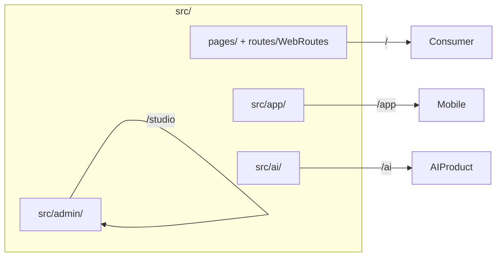

# Repository Folder Structure

Complete layout of the UNTOLD monorepo.

```
untold/
├── .github/workflows/          # CI/CD (ci.yml, cd.yml, backup-verify.yml)
├── backend/                    # FastAPI application
│   ├── alembic/                # Database migrations
│   │   └── versions/           # 001–038 migration files
│   ├── app/
│   │   ├── ai/                 # Unified AI provider layer
│   │   │   ├── adapters/       # Legacy registry bridge
│   │   │   ├── prompts/        # Prompt versioning
│   │   │   ├── providers/      # LLM, factory, registry
│   │   │   └── runtime/        # Invoke, retry, cost tracking
│   │   ├── api/v1/             # REST route modules (~50 routers)
│   │   ├── core/               # Config, deps, security, cache, redis
│   │   ├── db/                 # Session, migrations runner, seed
│   │   ├── domain/             # Business logic by domain
│   │   │   ├── ai/             # Cost optimizer
│   │   │   ├── gateway/        # API gateway auth, rate limits
│   │   │   ├── image/          # Image provider registry
│   │   │   ├── music/          # Music providers
│   │   │   ├── plugins/        # Plugin hooks
│   │   │   ├── research/       # Research providers
│   │   │   ├── security/       # Encryption, MFA, sanitization
│   │   │   ├── storage/        # Local / S3 storage
│   │   │   ├── studio/         # RBAC, enums
│   │   │   ├── translation/    # Translation providers
│   │   │   ├── vectorstore/    # Embeddings search
│   │   │   ├── video/          # Video providers
│   │   │   ├── voice/          # Voice providers
│   │   │   └── workflow/       # Workflow engine client
│   │   ├── gateway/            # External API gateway + GraphQL
│   │   ├── middleware/         # Rate limit, security headers
│   │   ├── models/             # SQLAlchemy ORM
│   │   │   └── studio/         # Studio sub-models
│   │   ├── schemas/            # Pydantic models
│   │   ├── services/           # Service orchestration layer
│   │   ├── websocket/          # Live + studio WebSocket
│   │   └── workers/            # Celery app + tasks
│   ├── scripts/                # Utility scripts (benchmark, openapi)
│   ├── tests/                  # Pytest suite
│   │   ├── unit/
│   │   ├── integration/
│   │   ├── factories/
│   │   └── mocks/
│   ├── docker-compose.yml      # Backend-only compose (legacy)
│   ├── Dockerfile              # API image (if at root of backend)
│   ├── pytest.ini
│   └── requirements*.txt
├── deploy/                     # Production infrastructure
│   ├── docker/                 # Dockerfile.api, Dockerfile.web, nginx.conf
│   ├── env/                    # Environment templates
│   ├── kubernetes/             # K8s manifests + kustomization
│   ├── monitoring/             # Prometheus, Grafana, OTEL, Promtail
│   └── scripts/                # backup.sh, restore.sh, smoke-test.sh, dr-runbook.sh
├── docs/                       # Enterprise documentation (this tree)
│   ├── adr/                    # Architecture Decision Records
│   ├── runbooks/               # Operational runbooks
│   ├── api-gateway/
│   ├── enterprise-security/
│   └── infrastructure/
├── e2e/                        # Playwright end-to-end tests
├── public/                     # Static assets
├── src/                        # Main React frontend (Vite)
│   ├── admin/                  # UNTOLD Studio (/studio)
│   │   ├── api/                # Studio API client
│   │   ├── components/         # Studio UI components
│   │   ├── config/             # studioNav.js
│   │   ├── context/            # AdminAuthContext
│   │   ├── features/           # Feature modules (research, scripts, …)
│   │   ├── layout/             # AdminLayout, Sidebar
│   │   ├── pages/              # Route page shells
│   │   └── routes/             # lazyPages.js
│   ├── ai/                     # UNTOLD AI product (/ai)
│   ├── app/                    # Mobile OTT (/app)
│   ├── api/                    # Consumer API clients
│   ├── components/             # Shared components
│   │   ├── brand/              # Logo variants
│   │   ├── layout/             # Navbar, Footer
│   │   ├── player/             # VideoPlayer
│   │   └── ui/                 # Button, Loader, SearchBar
│   ├── config/                 # ecosystem.js
│   ├── context/                # Theme, Auth, Watchlist, Locale
│   ├── data/                   # Mock catalogs (dev/demo)
│   ├── locales/                # i18n JSON
│   ├── pages/                  # Consumer pages
│   ├── plugin-sdk/             # Frontend plugin provider
│   ├── routes/                 # WebRoutes, AdminLegacyRedirect
│   ├── test/                   # Vitest setup + unit tests
│   └── utils/                  # sanitizeHtml, exploreSearch
├── studio/                     # Standalone TypeScript studio (optional)
│   └── src/                    # Separate Vite React app
├── docker-compose.yml          # Full dev stack
├── docker-compose.prod.yml     # Production overrides
├── docker-compose.monitoring.yml
├── docker-compose.logging.yml
├── index.html
├── package.json
├── playwright.config.js
├── vite.config.js
└── vercel.json                 # Frontend deployment config
```

## Key entry points

| File | Purpose |
|------|---------|
| `src/main.jsx` | Frontend bootstrap |
| `src/App.jsx` | Top-level router (web, app, studio, ai) |
| `backend/app/main.py` | FastAPI application |
| `backend/app/api/v1/router.py` | API route aggregation |
| `backend/app/ai/bootstrap.py` | AI provider registration |
| `docker-compose.yml` | Local full stack |

## Surface → directory mapping



## Backend domain map

| Directory | Responsibility |
|-----------|----------------|
| `api/v1/auth.py` | Authentication endpoints |
| `api/v1/studio_platform.py` | Projects, members, tasks |
| `api/v1/*_studio.py` | Creative workspace APIs |
| `domain/studio/rbac.py` | Permission definitions |
| `services/auth_service.py` | Login, refresh, Google OAuth |
| `workers/tasks.py` | Async Celery jobs |

## Documentation map

| Path | Content |
|------|---------|
| `docs/README.md` | Documentation index |
| `docs/architecture.md` | System design |
| `docs/adr/` | Architecture decisions |
| `docs/runbooks/` | Operations |

## Related documents

- [Architecture](./architecture.md)
- [Developer Guide](./developer-guide.md)
