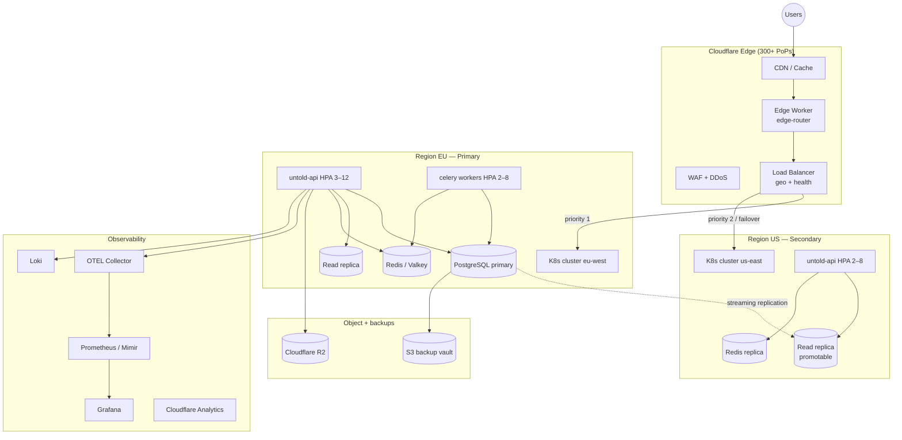

# Global Deployment Architecture

Production-ready design for running UNTOLD across regions with Cloudflare at the edge, autoscaling compute, replicated data, and full observability.

> **Prerequisites:** [Deployment Guide](./deployment-guide.md) · [Infrastructure](./infrastructure/README.md) · [ADR 0008](./adr/0008-global-cloudflare-multi-region.md)

## Goals

| Capability | Target |
|------------|--------|
| **Latency** | p95 &lt; 200ms for static; p95 &lt; 500ms API (same continent) |
| **Availability** | 99.9% monthly (excludes planned maintenance) |
| **RPO** | 1 hour (WAL + hourly snapshots) |
| **RTO** | 1 hour (automated failover path) |
| **Scale** | 3–50 API pods per region; edge absorbs static + cacheable reads |

## Topology



## Traffic flow

1. **DNS** — `untold.com`, `api.untold.com`, `studio.untold.com` proxied through Cloudflare (orange cloud).
2. **Static SPA** — Built assets on **Cloudflare Pages** or R2 + CDN. Immutable hashed files cached 1 year; `index.html` bypass cache.
3. **API / Gateway** — Cloudflare **Load Balancer** routes to regional origin pools. Health check: `GET /ready` (200).
4. **Edge Worker** (`deploy/cloudflare/workers/edge-router.js`) — Optional layer for:
   - Geo hints (`CF-IPCountry` → `X-UNTOLD-Region`)
   - Edge cache for safe GETs (`/api/v1/videos`, `/gateway/v1/videos`)
   - Bot management hooks and request ID injection
5. **WebSockets** — `/ws/*` proxied with WebSockets enabled; sticky sessions via Cloudflare session affinity or regional pinning.

## Cloudflare configuration

### DNS records

| Host | Type | Target | Proxy |
|------|------|--------|-------|
| `untold.com` | CNAME | Pages project | Proxied |
| `www` | CNAME | `untold.com` | Proxied |
| `api` | CNAME | Load Balancer | Proxied |
| `studio` | CNAME | Load Balancer or Pages | Proxied |
| `developers` | CNAME | Pages (same project) | Proxied |
| `cdn` | CNAME | R2 public bucket / custom domain | Proxied |

### Load balancer pools

| Pool | Origins | Health check | Priority |
|------|---------|--------------|----------|
| `eu-api` | `eu-lb.untold.internal` | `/ready` every 30s | 1 (active) |
| `us-api` | `us-lb.untold.internal` | `/ready` every 30s | 2 (failover / US users) |

**Steering:** Geo steering sends Americas to `us-api` when healthy; EU/APAC to `eu-api`. On pool failure, automatic failover to surviving region.

### WAF rules (baseline)

- OWASP Core Ruleset — managed
- Rate limit: 100 req/min per IP on `/api/v1/login`, `/api/v1/signup`
- Block countries not in service list (optional)
- Challenge on `/gateway/*` when bot score &lt; 30

### SSL/TLS

- Mode: **Full (strict)** — origin presents valid cert (cert-manager / Cloudflare origin CA)
- Minimum TLS 1.2; HSTS `max-age=31536000; includeSubDomains; preload`

### Cache rules

| Path pattern | Cache | TTL |
|--------------|-------|-----|
| `/assets/*` | Cache Everything | 1 year |
| `/api/v1/videos` GET | Cache (query string sort) | 60s |
| `/gateway/v1/videos` GET | Cache | 60s |
| `/api/*` POST/PUT/PATCH/DELETE | Bypass | — |
| `/ready`, `/health`, `/metrics` | Bypass | — |

Worker + Page rules in `deploy/cloudflare/pages/_headers`.

## Multi-region Kubernetes

Base manifests: `deploy/kubernetes/`. Regional overlays:

```bash
# Primary (EU)
kubectl apply -k deploy/kubernetes/overlays/eu-primary

# Secondary (US) — standby + read traffic
kubectl apply -k deploy/kubernetes/overlays/us-secondary
```

| Overlay | Replicas (API) | DB role | Celery |
|---------|----------------|---------|--------|
| `eu-primary` | 3–12 (HPA) | Primary + local read replica | Full workers + beat |
| `us-secondary` | 2–8 (HPA) | Read replica only | Workers only (no beat) |

**Beat scheduler:** Run **one** `celery-beat` deployment globally (EU only) to avoid duplicate cron triggers.

**Secrets:** Use External Secrets Operator syncing from Cloudflare / AWS / Vault — never commit `secrets.yaml`.

## Autoscaling

| Workload | Mechanism | Min | Max | Signal |
|----------|-----------|-----|-----|--------|
| `untold-api` | HPA v2 | 3 | 12 | CPU 70%, memory 80% |
| `untold-celery-worker` | HPA v2 | 2 | 8 | CPU 75%, queue depth* |
| Cloudflare → origin | LB auto | — | — | Origin latency / health |

\* Queue depth: optional KEDA `ScaledObject` on Redis `celery` queue length (documented in overlay README).

**Cluster autoscaler:** Node pool scales 3–20 nodes per region on pending pods.

**Pod disruption budgets:** `deploy/kubernetes/global/pdb.yaml` — min 2 available API pods during rollouts.

## Edge functions

Deploy the edge router Worker:

```bash
cd deploy/cloudflare
npx wrangler deploy
```

| Function | Responsibility |
|----------|----------------|
| `edge-router` | Regional origin selection, edge cache, security headers |
| Future: `edge-auth` | JWT validation at edge for public CDN assets (optional) |

Bindings (see `wrangler.toml`):

- `API_ORIGIN_EU`, `API_ORIGIN_US` — regional load balancer hostnames
- `CACHE_TTL_SECONDS` — default 60 for catalog GETs

## Caching strategy

| Layer | What | Invalidation |
|-------|------|--------------|
| **Cloudflare CDN** | SPA assets, public video lists, images via `cdn.untold.com` | Hash in filename; purge API on emergency |
| **Edge Worker** | Gateway read GETs | Short TTL + `stale-while-revalidate` |
| **Redis** | Sessions, rate limits, hot keys | TTL-based |
| **PostgreSQL** | Source of truth | No app-level cache for auth/billing |

Set `CDN_BASE_URL=https://cdn.untold.com` and R2 credentials in `deploy/env/global-production.env.example`.

## Database replication

**Recommended:** Managed PostgreSQL with cross-region read replicas (Crunchy Bridge, RDS, Neon Business, or Cloud SQL).

| Role | Region | Connection env |
|------|--------|----------------|
| Primary (writes) | EU | `DATABASE_URL` |
| Read replica (EU) | EU | `DATABASE_READ_URL` (optional, same region) |
| Read replica (US) | US | `DATABASE_READ_URL` in US overlay |

**Replication:** Streaming async replication; monitor lag alert &gt; 30s.

**Future app hook:** Route read-only SQLAlchemy sessions to `DATABASE_READ_URL` for list endpoints — until then, US API serves traffic only after EU failover promotes US replica.

### Failover (manual → automated)

1. Cloudflare LB detects EU pool unhealthy (&gt; 2 min).
2. Traffic shifts to US API pods (already on read replica).
3. Operator runs `deploy/scripts/global-failover.sh promote` — promotes US replica to primary.
4. Update `DATABASE_URL` in US secrets; scale EU to 0.
5. Re-establish replication EU as new replica when restored.

## Backup & disaster recovery

| Tier | Method | Frequency | Retention | Location |
|------|--------|-----------|-----------|----------|
| **Continuous** | WAL archiving / PITR | Real-time | 7 days | S3 / R2 |
| **Snapshot** | `pg_dump` CronJob | Daily 03:00 UTC | 30 days | PVC + `BACKUP_S3_URI` |
| **Config** | K8s etcd backup (provider) | Daily | 14 days | Cloud backup |
| **R2 media** | Object versioning | Continuous | 90 days | R2 bucket |

**Targets:** RPO **1 hour** (WAL), RTO **1 hour** (documented failover).

Scripts:

- `deploy/scripts/backup.sh` — daily dump
- `deploy/scripts/restore.sh` — restore + verify
- `deploy/scripts/global-failover.sh` — regional DR checklist
- `deploy/scripts/dr-runbook.sh` — local DR steps

**Quarterly:** Restore drill to staging; verify `backup-verify.yml` CI job.

## Observability

### Metrics (Prometheus)

- Scrape `/metrics` per API pod (`servicemonitor.yaml`)
- Federation: regional Prometheus → central **Grafana Mimir** or Grafana Cloud
- Alerts: `deploy/monitoring/prometheus/alerts.yml`

| Alert | Threshold |
|-------|-----------|
| `UntoldApiDown` | `up==0` for 2m |
| `HighErrorRate` | 5xx &gt; 5% for 5m |
| `HighLatencyP95` | p95 &gt; 2s for 10m |
| `ReplicationLag` | &gt; 30s (custom exporter) |
| `BackupFailed` | CronJob failure |

### Traces (OpenTelemetry)

- `OTEL_ENABLED=true`, exporter → regional collector → Grafana Tempo / Honeycomb
- Sample 10% in production; 100% on errors

### Logs

- JSON logs (`LOG_FORMAT=json`) → Promtail → Loki
- Cloudflare Logpush → R2 → analysis for edge 4xx/5xx

### Dashboards

- `deploy/monitoring/grafana/.../untold-api.json` — API golden signals
- Add: **Global Overview** — requests by region, CF cache hit ratio, replication lag

### SLOs

| SLI | SLO |
|-----|-----|
| API availability | 99.9% |
| `/ready` success | 99.95% |
| Video playback start | 99% &lt; 3s (CDN) |

## Production rollout checklist

### Phase 1 — Edge (week 1)

- [ ] Cloudflare account + zone; DNS proxied
- [ ] Pages deploy for SPA; `_headers` cache policy
- [ ] R2 bucket + `CDN_BASE_URL`
- [ ] WAF + rate limits enabled
- [ ] Deploy `edge-router` Worker

### Phase 2 — Primary region EU (week 2)

- [ ] K8s cluster + `kubectl apply -k deploy/kubernetes/overlays/eu-primary`
- [ ] Managed Postgres primary + WAL to S3
- [ ] Redis (HA): 3-node or managed
- [ ] HPA + PDB verified under load test
- [ ] Monitoring stack or Grafana Cloud connected

### Phase 3 — Secondary region US (week 3)

- [ ] US cluster + read replica replication
- [ ] Cloudflare LB geo steering + health checks
- [ ] Failover drill documented and timed

### Phase 4 — Hardening (week 4)

- [ ] Quarterly restore test scheduled
- [ ] On-call runbooks linked in PagerDuty/Opsgenie
- [ ] `global-production.env.example` values set in secret store
- [ ] Smoke: `API_URL=https://api.untold.com ./deploy/scripts/smoke-test.sh`

## Environment variables (global)

See `deploy/env/global-production.env.example` for the full list. Key additions over standard production:

```bash
CDN_BASE_URL=https://cdn.untold.com
S3_ENDPOINT=https://<account>.r2.cloudflarestorage.com
DATABASE_READ_URL=postgresql://...  # read replica (optional)
OTEL_EXPORTER_OTLP_ENDPOINT=https://otel.untold.internal:4318
TRUSTED_HOSTS=untold.com,api.untold.com,studio.untold.com
```

## Related artifacts

| Path | Purpose |
|------|---------|
| `deploy/cloudflare/` | Worker, Pages headers, Wrangler config |
| `deploy/kubernetes/overlays/` | EU primary / US secondary |
| `deploy/kubernetes/global/` | PDB, worker HPA |
| `deploy/scripts/global-failover.sh` | Regional DR script |
| `docs/adr/0008-global-cloudflare-multi-region.md` | Architecture decision |

## Cost guidance (order of magnitude)

| Component | Monthly (moderate traffic) |
|-----------|----------------------------|
| Cloudflare Pro + LB | $200–500 |
| 2× K8s clusters (3–6 nodes each) | $800–2,500 |
| Managed Postgres + replicas | $400–1,200 |
| R2 + egress | $50–300 |
| Grafana Cloud / self-hosted | $0–400 |

Scale with traffic; edge caching reduces origin egress significantly for OTT catalog workloads.
