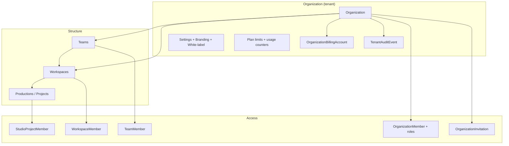

# UNTOLD Studio — Multi-Tenant SaaS Platform

Production-grade multi-tenancy for UNTOLD Studio: organizations, teams, workspaces, projects, invitations, isolation, billing, branding, and plan limits.

**Migration:** `039_multi_tenant_saas`  
**API prefix:** `/api/v1/studio/tenancy`

---

## Architecture



### Hierarchy

| Level | Purpose | Billing | RLS |
|-------|---------|---------|-----|
| **Organization** | Tenant root, plan, seats, storage quota | Yes | Audit + productions |
| **Team** | User grouping within org | No | App-layer |
| **Workspace** | Department / show / franchise container | No | App-layer |
| **Project** | Production (`productions` table) | Usage counted | PostgreSQL RLS |

### Isolation matrix

| Concern | Mechanism |
|---------|-----------|
| **Tenant isolation** | `organization_id` on projects, API keys; membership checks |
| **Billing isolation** | `organization_billing_accounts` per org; plan on `organizations` |
| **Storage isolation** | Key prefix `orgs/{org_id}/workspaces/{ws_id}/...` (`domain/tenancy/storage.py`) |
| **API isolation** | `X-Organization-ID` header + JWT; org-scoped API keys |
| **Audit isolation** | `tenant_audit_events` with RLS + checksum |
| **Row-level security** | PostgreSQL RLS on `productions`, `tenant_audit_events` |

---

## Database Changes

### New tables

| Table | Description |
|-------|-------------|
| `organizations` | Tenant root: plan, seats, storage, branding, limits |
| `organization_members` | User ↔ org with `OrganizationRole` |
| `teams` | Named teams within org |
| `team_members` | User ↔ team with `TeamRole` |
| `workspaces` | Project containers; optional `team_id` |
| `workspace_members` | User ↔ workspace with `WorkspaceRole` |
| `organization_invitations` | Email invites with hashed token |
| `organization_billing_accounts` | Per-org billing metadata |
| `tenant_audit_events` | Tenant-scoped audit log |

### Modified tables

| Table | New columns |
|-------|-------------|
| `productions` | `organization_id`, `workspace_id` (FK, indexed) |
| `studio_api_keys` | `organization_id` (FK, indexed) |

### Enums (PostgreSQL)

`organizationstatus`, `organizationplan`, `organizationrole`, `teamrole`, `workspacerole`, `invitationstatus`

### Row-level security

```sql
-- Session variables set per request:
-- app.current_organization_id
-- app.bypass_rls (platform admin)

ALTER TABLE productions ENABLE ROW LEVEL SECURITY;
-- Policies: SELECT/ALL filtered by organization_id
```

Application sets RLS via `TenantContextService.apply_rls()` in `get_tenant_context` dependency.

### Backfill (migration)

1. Creates `untold-default` organization (`is_system_default=true`)
2. Creates `default` workspace
3. Assigns all existing `productions` to default org/workspace
4. Adds studio users (`studio_role` or `is_admin`) as org members

---

## Migration Plan

### Phase 1 — Schema (zero downtime)

```bash
cd backend
alembic upgrade head   # through 039_multi_tenant_saas
```

- New columns nullable — existing API continues working
- Backfill runs in same migration

### Phase 2 — Application deploy

1. Deploy API with tenancy routes and tenant context
2. Clients may omit `X-Organization-ID` — resolves to user's primary org
3. Studio project list/create auto-scope to tenant context

### Phase 3 — Client updates (recommended)

1. Add org switcher in Studio UI
2. Send headers on all studio calls:
   ```http
   X-Organization-ID: 1
   X-Workspace-ID: 1
   ```
3. Implement invitation accept flow

### Phase 4 — Hardening (future)

- `NOT NULL` on `productions.organization_id` after all clients updated
- Extend RLS to `studio_assets`, `ai_generations`
- Stripe webhooks per `organization_billing_accounts`

### Rollback

```bash
alembic downgrade -1   # reverts 039 — drops tenancy tables, removes FK columns
```

See [Runbooks: Database Migration](./runbooks/database-migration.md).

---

## API Changes

### New endpoints

| Method | Path | Permission | Description |
|--------|------|------------|-------------|
| GET | `/studio/tenancy/organizations` | Studio user | List user's orgs |
| POST | `/studio/tenancy/organizations` | Studio user | Create org |
| GET | `/studio/tenancy/organizations/current` | Org member | Current org (from header or primary) |
| PATCH | `/studio/tenancy/organizations/current` | `org.update` | Update org |
| GET | `/studio/tenancy/organizations/current/usage` | `org.read` | Plan limits + usage |
| GET/PATCH/DELETE | `/studio/tenancy/organizations/current/members` | varies | Seat management |
| POST | `/studio/tenancy/organizations/current/invitations` | `org.invite` | Invite by email |
| POST | `/studio/tenancy/invitations/accept` | Authenticated user | Accept invite |
| GET/POST | `/studio/tenancy/organizations/current/teams` | varies | Teams |
| GET/POST | `/studio/tenancy/organizations/current/workspaces` | varies | Workspaces |
| PATCH | `/studio/tenancy/organizations/current/branding` | `branding.manage` | Logo, colors, white-label |
| PATCH | `/studio/tenancy/organizations/current/settings` | `settings.manage` | Org settings |
| GET | `/studio/tenancy/organizations/current/audit` | `audit.read` | Tenant audit log |

### Headers

| Header | Required | Description |
|--------|----------|-------------|
| `Authorization` | Yes | Bearer JWT |
| `X-Organization-ID` | No | Tenant context (defaults to primary org) |
| `X-Workspace-ID` | No | Filter projects / workspace scope |

### Modified endpoints (backward compatible)

| Endpoint | Change |
|----------|--------|
| `GET /studio/platform/projects` | Filtered by org (+ optional workspace) when headers set |
| `POST /studio/platform/projects` | Sets `organization_id`, `workspace_id`; enforces plan project limit |
| `ProjectResponse` | Adds optional `organization_id`, `workspace_id` |

### Organization roles

| Role | Capabilities |
|------|--------------|
| `owner` | Full control, billing, delete org |
| `admin` | Members, settings, branding, workspaces |
| `billing_admin` | Billing + audit read |
| `member` | Create projects, teams |
| `guest` | Read-only org access |

Project-scoped `StudioRole` (producer, writer, etc.) **unchanged**.

---

## Plan Limits

| Plan | Seats | Projects | Workspaces | Storage | AI/mo |
|------|------:|---------:|-----------:|--------:|------:|
| free | 3 | 5 | 1 | 5 GB | 100 |
| starter | 10 | 25 | 3 | 50 GB | 1,000 |
| pro | 50 | 200 | 20 | 500 GB | 10,000 |
| enterprise | 10,000 | 100,000 | 1,000 | 10 TB | 1M |

Overrides via `organizations.usage_limits` JSON.

Enforcement:
- `TenancyService.enforce_project_limit()` on project create
- Seat limit on invitation create
- Workspace limit on workspace create

---

## Security Review

### Strengths

| Control | Implementation |
|---------|----------------|
| Tenant boundary | `organization_id` FK + membership checks |
| Defense in depth | App-layer RBAC + PostgreSQL RLS |
| Invitation tokens | SHA-256 hashed at rest; 7-day expiry |
| Audit integrity | SHA-256 checksum per event |
| Cross-tenant project access | Blocked in `StudioPermissionService` |
| Platform admin | `is_admin` bypasses RLS with `app.bypass_rls` |
| Storage paths | Tenant-prefixed keys prevent cross-tenant object overlap |

### Residual risks

| Risk | Severity | Mitigation |
|------|----------|------------|
| RLS only on `productions` + audit | Medium | Extend RLS to assets, AI tables in phase 4 |
| Nullable `organization_id` on legacy rows | Low | Backfill + future NOT NULL |
| API keys without `organization_id` | Medium | Backfill keys to default org; require on create |
| Header spoofing | Low | Membership validated server-side |
| SQLite dev DB lacks RLS | Low | CI uses PostgreSQL |

### Threat model

- **Cross-tenant data leak:** Mitigated by RLS + org membership on context resolution
- **Privilege escalation:** Org roles separate from project roles; `org.members.manage` gated
- **Invite hijack:** Email must match authenticated user on accept

---

## Backward Compatibility

| Scenario | Behavior |
|----------|----------|
| No `X-Organization-ID` | Uses user's primary `organization_members` row |
| Existing projects | Migrated to `untold-default` org |
| Existing studio users | Added to default org as members |
| `studio_role` on user | Still gates studio; org membership also grants access |
| `GET /studio/platform/projects` without headers | Lists projects in primary org only |
| User-level subscriptions (OTT) | Unchanged — org billing is additive |
| Project RBAC | Unchanged (`StudioRole` + `PERMISSIONS`) |

---

## Production Checklist

- [ ] Run `alembic upgrade head` (039)
- [ ] Verify backfill: `SELECT COUNT(*) FROM productions WHERE organization_id IS NOT NULL`
- [ ] Create non-default org via API; confirm isolation
- [ ] Send `X-Organization-ID` from Studio client
- [ ] Test invitation flow end-to-end
- [ ] Confirm RLS: query productions with wrong `app.current_organization_id` returns empty
- [ ] Configure org branding / white-label for pilot customer
- [ ] Wire Stripe to `organization_billing_accounts` (external)
- [ ] Rotate default org slug if exposing publicly (`untold-default` → rename)

---

## Key Files

| Path | Purpose |
|------|---------|
| `app/models/studio/tenancy.py` | ORM models |
| `app/domain/tenancy/` | Enums, RBAC, context, RLS, storage, audit |
| `app/services/tenancy_service.py` | Business logic |
| `app/api/v1/tenancy.py` | REST API |
| `app/core/tenant_deps.py` | FastAPI dependencies |
| `alembic/versions/039_multi_tenant_saas.py` | Migration + RLS |
| `tests/unit/test_tenancy_rbac.py` | RBAC unit tests |

---

## Related

- [Authentication](./authentication.md)
- [Database](./database.md)
- [ADR 0004 — JWT session RBAC](./adr/0004-jwt-session-rbac.md)
- [Production Checklist](./production-checklist.md)
