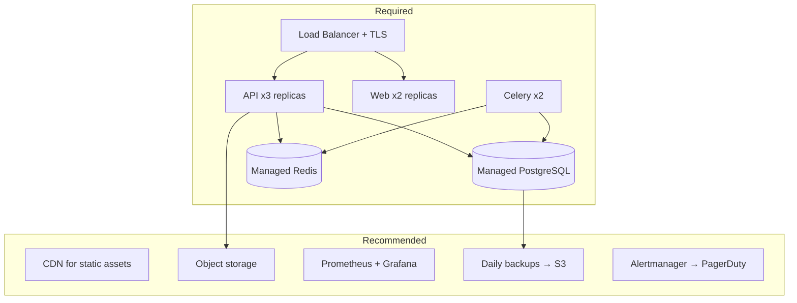
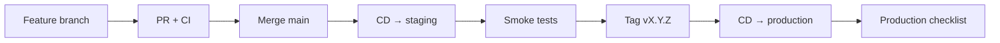

# Production Readiness

UNTOLD production readiness assessment — capabilities, gates, and maturity checklist.

## Readiness summary

| Area | Status | Notes |
|------|--------|-------|
| **Application** | Ready | Health probes, graceful errors, feature flags |
| **Security** | Ready | JWT, RBAC, CSP/HSTS, rate limits, encryption |
| **Observability** | Ready | Prometheus, Grafana, Loki, structured logs |
| **CI/CD** | Ready | GitHub Actions test + deploy pipelines |
| **Infrastructure** | Ready | Docker Compose + Kubernetes manifests |
| **Backups & DR** | Ready | Daily backups, runbooks, RPO/RTO defined |
| **Documentation** | Ready | Enterprise docs, runbooks, ADRs |
| **Testing** | Ready | Pytest, Vitest, Playwright, CI gates |
| **Performance** | Partial | Caching, pagination applied; see performance report |

## Production architecture

## Pre-production gates

Complete [Production Checklist](./production-checklist.md) before every release.

### Critical (block release if failing)

- [ ] `SECRET_KEY` and `ENCRYPTION_KEY` set (distinct, 32+ chars)
- [ ] `DEBUG=false`, `ENVIRONMENT=production`, `SEED_DATABASE=false`
- [ ] `CORS_ORIGINS` and `TRUSTED_HOSTS` locked to production domains
- [ ] TLS valid; HSTS enabled
- [ ] CI green on release commit
- [ ] `alembic upgrade head` applied
- [ ] Smoke tests pass (`deploy/scripts/smoke-test.sh`)
- [ ] `/ready` returns `ready` (DB + Redis)
- [ ] Backups configured with off-site copy

### High (resolve within 7 days of launch)

- [ ] Alertmanager wired to on-call
- [ ] Log aggregation verified in Grafana/Loki
- [ ] Celery worker autoscaling or replica count ≥ 2
- [ ] Managed Postgres with automated backups
- [ ] API docs disabled in production
- [ ] Default dev credentials rotated/removed

### Medium (ongoing improvement)

- [ ] CDN for `/assets/` with cache headers
- [ ] PgBouncer connection pooling
- [ ] Full performance benchmark (see [performance report](./performance-benchmark-report.md))
- [ ] HttpOnly cookie auth evaluation
- [ ] Multi-region DR plan

## Operational maturity

| Capability | Implementation |
|------------|----------------|
| **Deploy** | Rolling updates (K8s) or compose rebuild |
| **Rollback** | `kubectl rollout undo` / previous image tag |
| **Monitor** | Prometheus scrape `/metrics`; Grafana dashboards |
| **Alert** | `UntoldApiDown`, `HighErrorRate`, `HighLatencyP95` |
| **Log** | JSON logs → Loki via Promtail |
| **Trace** | OTEL collector (optional profile) |
| **Backup** | Daily CronJob + `backup.sh`; S3 off-site |
| **Restore** | `restore.sh` + DR runbook |
| **Secrets** | K8s Secrets / GitHub Environments |
| **Audit** | `enterprise_audit_events` for admin actions |

## SLO targets

| Metric | Target |
|--------|--------|
| Availability | 99.5% monthly |
| API p95 latency | < 2s |
| Error rate (5xx) | < 1% |
| RPO | 24 hours |
| RTO | 4 hours |

## Security compliance

| Control | Status |
|---------|--------|
| Authentication | JWT + optional MFA |
| Authorization | RBAC (studio + admin) |
| Encryption at rest | Postgres + Fernet secrets vault |
| Encryption in transit | TLS 1.2+ |
| Input validation | Pydantic + sanitization |
| Output encoding | HTML sanitization (XSS) |
| Rate limiting | Auth + AI + gateway |
| Audit logging | Enterprise audit events |
| Dependency scanning | CI (recommended: Dependabot) |

See [Security Improvements](./security-improvements.md).

## Release process

1. Merge to `main` → automatic staging deploy
2. Validate staging smoke tests
3. Tag `v*.*.*` → production deploy (with environment approval)
4. Run production checklist
5. Monitor Grafana for 30 minutes post-deploy

## Known limitations

| Item | Mitigation |
|------|------------|
| JWT in localStorage | CSP + XSS hygiene; cookies planned |
| Single-region default | Off-site backups; DR runbook |
| SQLite in unit tests | CI runs Postgres integration |
| Disk space (local dev) | Monitor; prune Docker volumes |

## Sign-off template

| Role | Name | Date | Signature |
|------|------|------|-----------|
| Engineering lead | | | |
| DevOps / SRE | | | |
| Security | | | |
| Product owner | | | |

## Related documents

- [Production Checklist](./production-checklist.md)
- [Deployment](./deployment.md)
- [Runbooks](./runbooks/README.md)
- [Testing Guide](./testing-guide.md)
